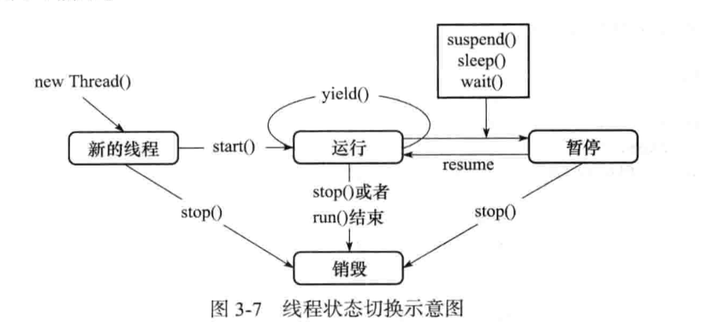

## 书评

- 傻逼出书的错误真多
- 哪里核心了，明明是基础入门
- 推荐指数：1颗星，不推荐深入，入门也需要谨慎，错误实在多，硬生生的凑例子，占篇幅。
- 过于老旧，ConcurrentHashMap都没讲到。

## 进程和线程

- 进程：受操作系统管理的基本运行单元
- 线程：在进程中独立运行的子任务

## main线程

- main方法是在名字为main的线程中运行的

## 实现多线程的两种方式

- 继承Thread(已经实现了Runnable接口)，如果要创建的线程类已经有一个父类了，无法再继承Thread，那就用实现接口的方式
- 实现Runnable

## 线程调用的随机性

- 代码的运行结果与代码的调用顺序无关，CPU随机调用

  ```
  public static void main(String[] args) {
      MyThread myThread = new MyThread();
      myThread.start();
      System.out.println("main" + Thread.currentThread().getName());
  }
  
  不同机器上每次执行输出的顺序不一样，随机性
  ```

- thread.run() vs thread.start()

  ```
  thread.run() 在main线程同步执行，没有去启动新线程，只有start()才会通知线程规划器去启动新的线程
  thread.start() 通知线程规划器去执行run，run异步执行
  
  Thread的run()：
  @Override
  public void run() {
    if (target != null) {
        target.run();
       }
  }
  如果是继承Thread实现，那么就运行重写的run
  如果是实现Runnable接口，那么就运行target(Runnable)的run
  ```

- start()

  ```
  启动新的线程，通知jvm去调用线程的run方法
  
  public static void main(String[] args) {
          for (int i = 0; i < 10; i++) {
              MyThread myThread = new MyThread(i);
              myThread.start();
          }
          System.out.println("main" + Thread.currentThread().getName());
  }
  //输出1 0 2 3 4 5 6 7 8 main 9
  ```

## 线程不安全 vs 线程安全

- 线程安全：不共享变量

- 线程不安全：共享变量，多个线程对同一对象的同一个实例操作，出现值不同步问题（脏读）

  ```
  如何解决：给对象或者方法加synchronize，使加锁的代码变成互斥区
  ```

  ```
  注意i--不是原子操作，包含三步
  ```

## Thread的方法

- Thread.currentThread().getName()—这行代码运行所处的线程的name
- thread.getName()—线程实例的线程name
- thread.isAlive()—测试线程是否处于活动状态，活动状态就是线程已经启动并且尚未终止
- Thread.sleep(2000)—让当前正在执行的线程休眠多久
- thread.getId()—获取线程的唯一标识id
- thread.getState()-获取线程的状态，可以用于debug环境下打日志

## 如何停止线程

- 使用interrupt方法中断线程

  ```
  thread.interrupt()中断线程，然后catch，捕获异常
  ```

- 使用退出标志，使线程正常退出

  ```
  thread.interrupt()中断线程，然后return，没有抛异常好，抛异常可以把异常传播出去
  ```

- 使用stop方法强行终止线程，不推荐使用，已作废，会产生不可预期的效果

  ```
  会抛出ThreadDeath异常，会释放被锁住的对象
  ```

## interrupted() vs isInterrupted vs interrupt()

```
thread.interrupted()判断当前线程是否停止状态
注意：调用完会清除线程的中断状态，所以连续两次调用，第二次调用返回false

thread.isInterrupted()判断当前线程是否停止状态
注意：不清除状态标志

thread.interrupt()中断线程
```

## 如何暂停线程和恢复线程

- thread.suspend()

  ```
  suspend和锁交互的时候要注意，会占住锁，导致锁无法释放。
  注意和synchronized、println()交互
  ```

- thread.resume()

- 应用：

  ```
  thread.suspend();
  //
  waitOtherThingFinish();
  //
  thread.resume();
  ```

## yield()

- Thread.yield()：暂时放弃当前的CPU，将CPU让给其他的任务，但还会恢复。但时间不确定，可能刚刚放弃又马上获得。

## 线程的优先级

- CPU优先执行优先级较高的线程对象中的任务，优先级高的不一定每一次都先执行完，具有随机性
- 线程的优先级具有继承性，A启动B，B的优先级继承自A

## 守护线程

- 守护线程

  ```
  任何一个守护线程都是整个JVM中所有的非守护线程的保姆，只要当前JVM中存在任何一个非守护线程没有结束，守护线程就在工作，只有当最后一个非守护线程结束时，守护线程才随着JVM一同结束工作。
  
  比如：垃圾回收器
  
  public static void main(String[] args) throws InterruptedException {
          Thread thread = new Thread(new Runnable() {
              @Override
              public void run() {
                  int i = 0;
                  while (true) {
                      i++;
                      try {
                          Thread.sleep(1000);
                      } catch (InterruptedException e) {
                          e.printStackTrace();
                      }
                      System.out.println(i);
                  }
              }
          });
          thread.setDaemon(true);
          thread.start();
          Thread.sleep(5000);
          System.out.println("因为thread是守护线程，所以这个时候没有非守护线程了，守护线程就销毁");
   }
  ```

- 非守护线程

## synchronized

- synchronized获取的是对象的锁(同步方法&synchronized(this)同步代码块)

- 同步方法 非同步方法（synchronized(this)同步代码块 非同步代码块）

  ```
  A线程先持有对象的锁，B线程可以用异步的方式调用对象的非synchronized类型的方法
  
  A线程先持有对象的锁，B线程只能同步的调用对象的synchronized类型的方法
  
  //同步方法、synchronized(this)同步代码块通用
  ```

- synchronized拥有锁重入的功能

  ```
  可重入锁：自己可以再次获取自己的内部锁。
  
  支持在父子类的继承环境中。
  
  public class Service {
      synchronized public void service1() {
          System.out.println("service1");
          service2();
      }
  
      synchronized public void service2() {
          System.out.println("service2");
          service3();
      }
  
      synchronized public void service3() {
          System.out.println("service3");
      }
  
      public static void main(String[] args) {
          Thread thread = new Thread(new Runnable() {
              @Override
              public void run() {
                  Service service = new Service();
                  service.service1();
              }
          });
          thread.start();
      }
  }
  //输出
  service1
  service2
  service3
  ```

- 出现异常，锁自动释放

- 同步不具有继承性：重写的时候，子类的非同步方法，不能继承父类的同步效果

- 同步方式

  - 同步方法

    ```
    synchronized public void service() {
        //...
    }
    ```

  - 同步代码块

    ```
    
    public void service() {
        synchronized(this) {
        	//...
        }
    }
    //
    不在synchronized块中就是异步执行，在synchronized块中就是同步执行。
    ```

## synchronized(非this对象)

- synchronized(非this对象x)：获得的是对象x的锁

- 对象监视器不同，异步执行

  ```
  public class Thing {
      private String anything = new String();
  
      public void a() throws InterruptedException {
          synchronized (anything) {
              System.out.println(Thread.currentThread().getName() + "begin");
              Thread.sleep(2000);
              System.out.println(Thread.currentThread().getName() + "end");
          }
      }
  
      synchronized public void b() throws InterruptedException {
          System.out.println(Thread.currentThread().getName() + "begin");
          Thread.sleep(2000);
          System.out.println(Thread.currentThread().getName() + "end");
      }
  
      public static void main(String[] args) {
          Thing thing = new Thing();
          Thread threadA = new Thread(new Runnable() {
              @Override
              public void run() {
                  try {
                      thing.a();
                  } catch (InterruptedException e) {
                      e.printStackTrace();
                  }
              }
          });
          threadA.setName("A");
          threadA.start();
  
          Thread threadB = new Thread(new Runnable() {
              @Override
              public void run() {
                  try {
                      thing.b();
                  } catch (InterruptedException e) {
                      e.printStackTrace();
                  }
              }
          });
          threadB.setName("B");
          threadB.start();
          
      }
  }
  
  输出：
  Abegin
  Bbegin
  Aend
  Bend
  ```

## synchronized静态方法

- synchronized加到静态方法是给Class类上锁，而synchronized加到非静态方法上是给对象上锁

- 还是那句话：对象监视器不同，异步执行，否则同步

- 同步静态方法 & 同步静态代码块

  ```
  synchronized public static void a() {
      
  }
  
  public static void a() {
      synchronized(XXX.class){
          //...
      }
  }
  ```

## String常量池特性与synchronized结合的特殊效果

- 一般不用String作为锁，因为如果值一样锁住的是同一个对象。

  ```
  String a = “a”; String b = "a"; a==b true。
  ```

## Java内存模型

- 高速CPU和低速内存，引出了三层缓存

- 可见性、原子性、有序性

- 同步到主内存的时机

  ```
  注意：与System.out.println()使用时候的特殊性，里面有锁
  ```

- 内存屏障

## volatile关键字

- 主要作用：使变量在多个线程间可见（可见性）。

- volatile

  - 保证可见性：强制从公共内存读取变量的值
  - 不保证原子性
  - 轻量级

## 原子类

- AtomicInteger

  ```
  支持高并发，非阻塞，轻量级
  
  源码：
  AtomicInteger{
      private static final Unsafe unsafe = Unsafe.getUnsafe();
      
      private volatile int value;
      //用volatile修饰,保证了value在内存中其他线程可以看到其值得改变
      
      public final int incrementAndGet() {
          return unsafe.getAndAddInt(this, valueOffset, 1) + 1;
          //内部使用了CAS，保证了安全的改变value的值，保证了原子操作
          //乐观锁也应用了CAS机制，先假设没有冲突直接进行操作，如果有冲突而失败就重试，直到成功。
      }   
  }
  
  //Unsafe：
  Unsafe {
      public final int getAndAddInt(Object var1, long var2, int var4) {
          int var5;
          do {
              var5 = this.getIntVolatile(var1, var2);
          } while(!this.compareAndSwapInt(var1, var2, var5, var5 + var4));
  
          return var5;
      }
  }
  ```

## 等待通知机制

- 为何需要

  ```
  当一个线程好了的时候，才去通知另一个线程做接下来的事情，可以避免浪费无意义的CPU资源消耗。
  ```

- synchronized+wait/notify方式

  ```
  wait：使线程停止运行
  1.需要在同步里使用
  2.wait后会立马释放锁
  
  notify：使停止的线程继续运行
  1.需要在同步里使用
  2.notify后不会立马释放锁，同步执行完会释放锁
  3.通知wait线程获取对象锁，并继续执行wait线程。
  
  notifyAll：使所有正在等待队列中等待同一共享资源的全部线程从等待状态退出，进入可运行状态。
  
  ```

- wait(5000)：等待几秒，如果没有提前被唤醒，就自动唤醒。

  ```
  wait(5000) ：暂停5秒，并且释放锁
  vs  
  sleep(5000)：暂停5秒，但是不释放锁
  ```

- ReentrantLock+condition方式—进阶版

  ```
  ReentrantLock+condition：
  轻松实现唤醒指定的线程。
  一个lock跟多个condition绑定，可以指定具体线程唤醒。
  
  vs 
  
  synchronized+wait/notify:
  JVM随机选择一个wait状态的线程/notifyAll
  
  ```


## 线程状态切换




## 锁对象的两个队列

- 就绪队列：存储了将要获得锁的线程。
- 阻塞队列：存储了被阻塞的线程。

## 管道在线程中的通信

- 字节流传输

  ```
  PipedOutputStream PipedInputStream
  out.connect(input);//给输出流一个接收者，也就是input。
  input.connect(out);//内部调用了out.connect(input)。
  ```

- 字符流

  ```
  PipedWriter PipedReader 
  out.connect(input);//给输出一个接收者，也就是input。
  ```

## join

- 作用

  ```
  threadA.join();
  是A正常执行run()，使当前线程等待直到run执行完毕。
  ```

- join vs synchronized

  ```
  相同：阻塞
  
  不同：join内部使用wait实现，synchronized内部使用对象监视器实现。
  ```

- join vs sleep

  ```
  thread.join()内部实现用了wait()，会释放当前thread对象锁。
  vs
  Thread.sleep()不会释放锁
  
  但是这个作者有毒吧，一个是静态方法，一个是实例方法，有啥可比性。
  ```

## ThreadLocal

- 作用：每个线程保存自己的值，线程之间数据的隔离。

- 底层数据结构

  ```
  Thread{
      ThreadLocal.ThreadLocalMap threadLocals;//跟Thread生命周期一致
  }
  ```

- get() 返回默认值

  ```
  子类重写initialValue()方法
  ```

- InheritableThreadLocal

  ```
  1.A启动B，B可以继承A的值
  
  2.B如果想修改继承到的值，可以重写childValue方法
  ```

## ReentrantLock（瑞安蠢te）

- 可重入锁 

  ```
      public void method1() {
          try {
              lock.lock();
              System.out.println("hold count = " + lock.getHoldCount());
              method2();
          } finally {
              lock.unlock();
          }
      }
  
      public void method2() {
          try {
              lock.lock();
              System.out.println("hold count = " + lock.getHoldCount());
          } finally {
              lock.unlock();
          }
      }
      
      //输出
     	hold count = 1
  	hold count = 2
  	
  	
  	理解重入：
  	一个线程获取了锁之后，再去获取同一个锁，仅仅是把状态值累加，释放一次，状态值减去1，直到0，锁才可以被其他线程抢占。
  	
  公平 vs 不公平：状态为0，看是否按照队列来占有锁，还是抢占锁。	
  ```

- lock.lock()

  ```
  获取“对象监视器”，其他线程阻塞等待，当前线程继续运行。
  需要在finally块中手动lock.unlock().
  ```

- lock.newCondition()

  ```
  返回一个condition实例，跟lock实例绑定。
  ```

- condition.await()

  ```
  0.调用之前，要先调用lock.lock()，需要在获取到锁对象才可以调用。
  1.导致当前线程等待，自动释放锁。
  
  功效上 == object.wait()
  ```

- condition.signal()

  ```
  0.调用之前，要先调用lock.lock(),需要在获取到锁对象才可以调用。
  1.唤醒等待的线程
  
  功效上 == object.notify()
  ```

- sync的分类

  ```
  公平锁：新进入链表的先获取锁，后进入链表的后获取锁
  
  非公平锁：随机抢占式获取锁
  ```

- vs synchronized性能优势：

  ```
  >=JDK6，没有差别；
  小于6，优于Synchronized。
  ```


## ReentrantReadWriteLock

- 共享锁：读操作。

  ```
  lock.readLock().lock();
  ```

- 排他锁：出现写操作，就互斥。

  ```
  lock.writeLock().lock();
  ```

- 应用

  ```
  1.rocketmq，nameserver路由表的注册和删除用到了，读性能高。
  ```

## Timer定时器

- 内部实现--其实就是封装了一下Thread和Runnable啥的

  ```
  Timer{
      //属性
      TimerThread thread;
      TaskQueue queue;
      
      构造器{
          thread.start();
      }
      
      schedule(){
          queue.add(task);
      }
  }
  
  TimerThread extends Thread{
  	//属性
      TaskQueue queue;(元素是TimerTask)
      
      run(){
          while(true){
              queue中取出task.run();
          }
      }
  }
  
  TimerTask implements Runnable{
      
  }
  ```

- 方法

  ```
  延迟执行
  public void schedule(TimerTask task, long delay) {}
  
  周期性执行
  public void scheduleAtFixedRate(TimerTask task, long delay, long period) {}
  
  cancel()
  不一定会停止，不一定能获取到queue的锁。
  ```

## 多线程下的单例模式

- 饿汉模式 vs 懒汉模式

  ```
  饿汉模式：提前创建好实例
  
  懒汉模式：延迟到使用的时候再创建实例
  ```

- 饿汉模式单例

  ```
  public class MyObject {
      private static MyObject myObject = new MyObject();
  
      private MyObject() {
      }
  
      public static MyObject getInstance() {
          return myObject;
      }
  
      public static void main(String[] args) {
          for (int i = 0; i < 5; i++) {
              new Thread(new Runnable() {
                  @Override
                  public void run() {
                      System.out.println(MyObject.getInstance().hashCode());
                  }
              }).start();
          }
      }
  }
  
  //静态代码块
  public class MyObject4 {
      static {
          myObject4 = new MyObject4();
      }
  
      private static MyObject4 myObject4 = null;
  
      private MyObject4() {
      }
  
      public static MyObject4 getInstance() {
          return myObject4;
      }
  }
  
  //静态内置类
  public class MyObject3 implements Serializable {
      private static final long serialVersionUID = -1;
  
      private static class MyObjectHandler {
          private static MyObject3 myObject3 = new MyObject3();
      }
  
      private MyObject3() {
  
      }
  
      public static MyObject3 getInstance() {
          return MyObjectHandler.myObject3;
      }
      
      //没实现序列化，不需要，反之需要，否则反序列后拿到的对象不是同一个
      protected Object readResolve() {
          return MyObjectHandler.myObject3;
      }
  }
  ```

- 懒汉模式单例—双检查锁机制（使用这种方式）

  ```
  public class MyObject2 {
      private static volatile MyObject2 myObject2;
  
      private MyObject2() {
      }
  
      public static MyObject2 getInstance() {
          if (myObject2 != null) {
  
          } else {
              try {
                  //模拟创建对象，对象初始化动作
                  Thread.sleep(3000);
              } catch (InterruptedException e) {
                  e.printStackTrace();
              }
              synchronized (MyObject2.class) {
                  if (myObject2 == null) {
                      myObject2 = new MyObject2();
                  }
              }
          }
          return myObject2;
      }
   }   
  ```

- 枚举实现单例

## 线程组

- 用于组织管理线程

## 线程异常处理器

- 设置对象的异常处理器

  ```
  public void setUncaughtExceptionHandler(UncaughtExceptionHandler eh) {}
  
  
  public interface UncaughtExceptionHandler 
  {
  		//该方法最终由JVM调用
          void uncaughtException(Thread t, Throwable e);
  }
  ```

- 设置类的异常处理器

  ```
  public static void setDefaultUncaughtExceptionHandler(UncaughtExceptionHandler eh) {}
  ```

## 全书完结-撒花