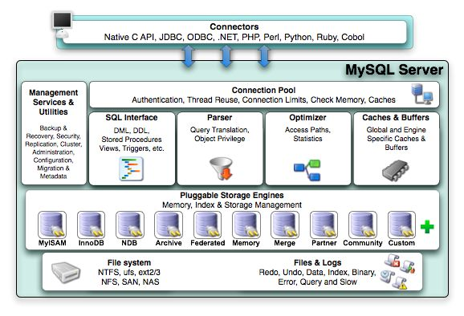
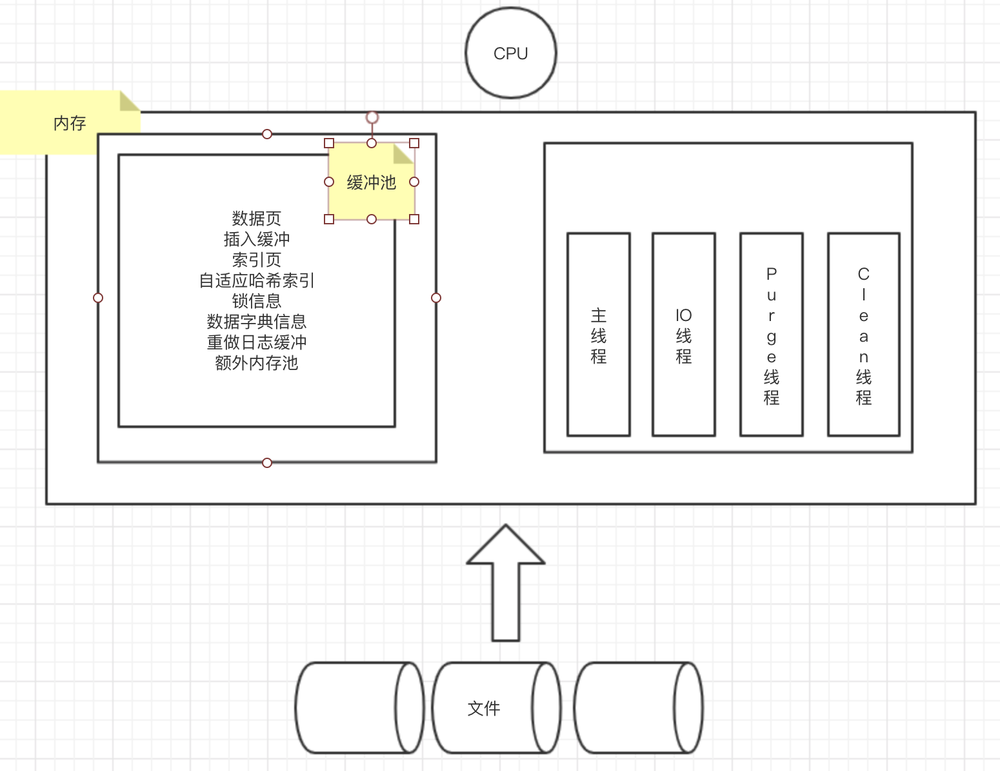
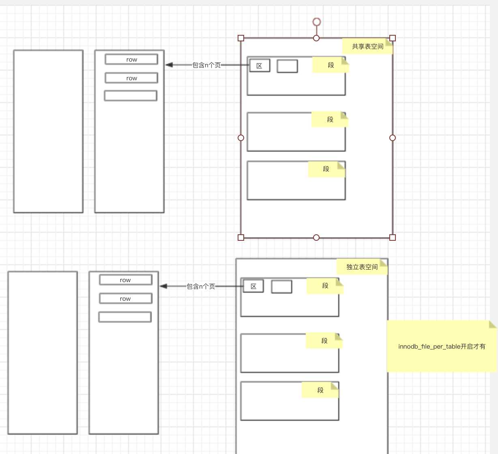
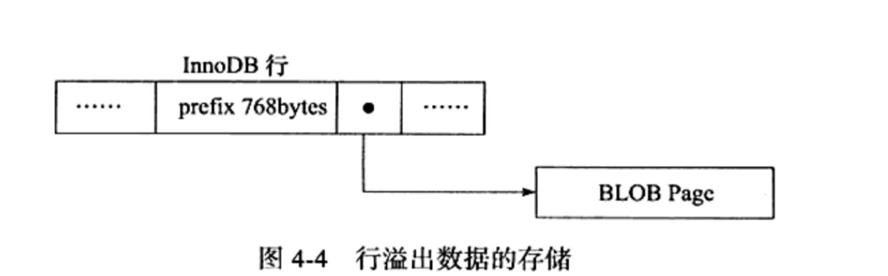

## 数据库 vs 实例

- 数据库：文件集合
- 实例：运行mysql的程序，包含后台线程和共享内存区
- 关系：集群模式下，一个数据库可以被多个实例共享，非集群模式下，数据库和实例一对一

- Mysql：单进程多线程架构

## mysql体系结构



```
Mysql组成：
1.连接池组件
2.管理服务和工具组件
3.SQL接口组件
4.查询分析器组件
5.优化器组件
6.缓冲组件
7.插件式存储引擎
8.物理文件

特性：
1.插件式表存储引擎，底层物理结构实现
存储引擎是基于表的，而不是针对数据库的，颗粒度更细，一个数据库的不同的表可以采用不同的存储引擎

存储引擎是可以自定义实现的，用户可以自己修改写自己的存储引擎

```

## Mysql存储引擎分类

- InnoDB存储引擎

  ```
  特性：
  1.支持事务
  2.高并发性：多版本并发控制MVCC
  3.实现了四种隔离级别，默认是REPEATABLE
  4.支持全文索引
  5.行锁设计
  6.支持外键
  7.提供一致性非锁定读
  ```

- MyISAM存储引擎

  ```
  特性：
  1.不支持事务
  2.缓冲池只缓冲索引文件，不缓冲数据文件
  3.支持全文索引
  4.在
  ```

## 连接mysql

- 连接的本质：一个连接进程和mysql实例通信，进程之间的通信

- 进程通信方法：TCP/IP、命名管道和共享内存、unix域套接字

- mysql的TCP/IP通信过程

  ```
  一个服务器上的mysql客户端通过ip访问在另一台服务器上的mysql实例
  mysql -h 192.168.0.101 -u root -p
  
  mysql实例收到连接请求，检查权限视图(user表)，看是否允许连接
  ```

## InnoDB体系架构



```
存储引擎组成内容：
1.内存池（是cpu和磁盘之间的桥梁）
缓存磁盘数据
缓存redo log

读的时候，先从缓冲池读，没读到读入缓冲池，再返回给客户端
写的时候，先写入缓冲池，再异步刷到磁盘

包含内容：
数据页
插入缓冲
索引页
自适应哈希索引
锁信息
数据字典信息
重做日志缓冲
额外内存池

采用的算法：改进版LRU，midpoint设计

2.后台线程
Master Thread：异步从缓冲池把数据刷到磁盘

何时刷新，基于checkpoint技术

IO Thread：异步写IO请求
包含如下：
insert buffer thread-0
log thread-1
read thread-2\3\4\5
write thread-6\7\8\9

Purge Thread：undo页回收

Page Cleaner Thread：脏页刷新

```

## 重做日志缓冲刷新到文件的时间

```
1.Master Thread每一秒
2.每个事务提交时候
3.重做日志缓冲池剩余空间小于一半时
```

## 脏页

```
定义：
如果某个页的记录被改变了，那么页就是脏的，也就是脏页。需要刷新到磁盘。

```

## 重做日志redo log存在的意义是什么

```
缓冲池的页会被异步刷新到磁盘，如果刷新的时候，数据库宕机了，数据（脏页）岂不是丢失了。

这个时候就需要redo log出场。

事务提交的时候，先写重做日志，再修改页。这样即使宕机，也可以通过重做日志，恢复页数据
```

## Checkpoint技术

- 为何需要这个技术？

  每次有脏页就刷新，性能得多差,如果热点数据就几页，那性能得更差。

- 该技术解决的问题？

  1. 缩短宕机后数据库的恢复时间

     宕机的时候，不用恢复所有的重做日志，只需要对checkpoint之后的日志进行恢复，故数据库恢复时间缩短

  2. 缓冲池不够用的时候，将脏页刷新到磁盘

  3. 重做日志不可用时，刷新脏页

- 什么时候触发checkout

  ```
  Sharp Checkoutpoint：
  数据库关闭时，所有的脏页都会刷新回磁盘
  
  ```

  ```
  Fuzzy Checkoutpoint：
  只刷新一部分脏页数据到磁盘
  
  1.Master Thread Checkoutpoint：
  主线程每秒/10秒从缓存池刷新一定比例的脏页，异步的，不影响查询线程。
  
  2.Dirty Page too much Checkoutpoint：
  脏页太多，强制触发检查点
  根据参数innodb_max_dirty_pages_pct 脏页比例
  
  3.Flush_lru_list checkoutpoint：
  lru列表可用空间不够100，会刷新列表尾部的脏页
  
  4.async/sync flush checkoutpoint：
  重做日志不可用，强制刷新脏页到磁盘
  ```

## Master Thread的工作方式

- 随着版本升级性能提升

- 大致工作方式

  ```
  一个主线程，内部由多个循环相互切换组成
  
  包含：
  主循环 loop
  后台循环 background loop
  刷新循环 flush loop
  暂停循环 suspend loop
  ```

  - 主循环

    ```
    每秒做的事情(不一定是准确的一秒)：
    从缓存池把日志刷新到磁盘
    合并插入缓冲池的请求
    刷新脏页到磁盘，不一定执行
    如果没有用户活动，切换到后台循环
    
    每10秒做的事情：
    刷新100个脏页到磁盘，不一定执行
    合同最多5个插入缓冲
    从缓存池把日志刷新到磁盘
    删除无用的undo页
    刷新100个脏页到磁盘，一定执行
    
    其中，很多都可以可配置的：
    刷新脏页的个数
    插入缓冲合并个数
    ```

  - 后台循环

    ```
    删除无用的undo
    合同20个插入缓冲
    调回主循环
    可能跳转到刷新循环
    ```

  - 刷新循环

    ```
    如果没事做，就跳转到暂停循环
    ```

  - 暂停循环

## InnoDB关键特性

- 插入缓冲

  ```
  原理：先判断插入的非聚集索引页是否在缓存池中，如果是，直接插入，如果不是，先放入到一个Insert Buffer对象中，然后以一定的频率批量合并Insert Buffer对象和辅助索引节点
  
  适用条件：
  辅助索引
  索引不是唯一的
  
  数据结构：B+树
  
  改进版，对于insert，delete，update都有批量优化
  
  ```

- 两次写

  ```
  为何需要？
  重做日志损坏的情况下，数据库宕机，如何恢复？
  
  在缓存池和数据库之间添加了一层双写缓存，存了一份副本。
  ```

- 自适应哈希

  ```
  根据热点数据自动建立哈希索引，哈希时间复杂度为O(1)
  ```

- 异步IO

  ```
  同时发起多个IO请求，合并结果返回
  ```

- 刷新邻接页

  ```
  
  ```

## 存储引擎的关闭

- 可以指定是否等undo页都回收掉，是否等缓冲池都刷新回磁盘等

## 文件

包含哪些文件

```
参数文件
日志文件
socket文件
pid文件：mysql启动的时候，将进程id写入文件中
mysql表结构文件
存储引擎文件：记录和索引
```

### 参数文件

```
作用：在mysql启动的时候，读取参数文件启动，指定mysql启动的一些参数

存储：key=value 键值对

查看示例：
show variables like 'innodb_buffer%';

参数类型：
动态参数：启动后可以修改，支持全局修改和会话修改
静态参数：启动后不可以修改，修改会报修改失败

```

### 日志文件

```
包含：
1.错误日志 error log
作用：指导dba分析启动失败原因/警告信息

2.慢查询日志 show query log
通过参数long_query_time设置，默认10秒，开启，超过10秒会记录到文件，等于不记录
通过参数log_slow_queries开启慢查询，默认不开启
slow_log表也会记录慢查询日志,通过指定log_output为table即可
作用：分析慢查询，优化应用查询

3.二进制日志 binlog
记录update和delete请求信息
作用：可以根据binlog用来对数据进行恢复和复制

4.查询日志 log
记录所有的请求信息
```

### 表结构定义文件

```
每个表都有对应的表结构定义文件，文件以frm为后缀
```

### InnoDB表存储引擎文件

**表空间文件**

```
默认表的数据会存储在共享的表空间文件ibdata1上

如果开启了innodb_file_per_table，那么会给基于innodb存储引擎的表产生一个独立的表空间，存放表的数据，文件：表名.ibd，但是回滚信息，事务信息还是存放在共享表空间上。
```

**重做日志文件**

```
作用：
记录存储引擎的事务日志

写入方式：
->insert buffer->重做日志文件

组成：
最少一个重做日志文件组，每个组最少2个重做日志文件
```

## 表

### 主键的选择

```
主键选择的规则：
1.显式定义
2.第一个定义的非空唯一索引
3.以上都没有，引擎自动创建一个6个字节大小的指针

```

### 表逻辑存储结构



```
定位某一行:
共享表空间->段->区->页->row

区的大小：1MB
页的大小：innodb_page_size

```

**页**

```
数据页
undo页
系统页
事务数据页
...
```

## InnoDB行记录格式

```
有两种，Compact和Redundant。
Redundant是兼容老版本而存在的，目前默认是Compact

新增的行记录格式：
Compressed
Dynamic

如何指定：row_format=XXX
```

### Compact行记录格式


**一行一行记录是如何串起来的呢**

```
链表的形式串起来的，当前行记录加上下一个记录的偏移量就是下一个记录的起始位置。当前记录和偏移量存放在
记录头信息里。
```

```
除了上面显示的信息，还有隐藏列，事务ID列和回滚指针列
```

### Redundant行记录格式


### varchar类型真的可以存放65535字节么

```
1.不可以

2.建表的时候给varchar类型分配65535字节会报错,Column length too big for column 'name' (max = 16383); use BLOB or TEXT instead,因为除了存放数据，还有别的开销

3.65535的实际含义
官方文档中说的是varchar所有列的长度总和支持65535字节
而varchar(N) N的含义是当前列最大支持的字符的长度，而不是字节
```

### 列存放的长度太多，溢出了，数据是如何存放的，溢出的临界值是多少呢



```
溢出的时候：行记录里存放的是768字节的前缀和一个指向blob page的偏移量

溢出的临界值是8098长度
```

## 常用参数配置

```
缓冲池大小
innodb_buffer_pool_size

缓冲池实例的个数(提高并发)
innodb_buffer_pool_instances

重做日志缓冲大小
innodb_log_buffer_size

undo回收线程个数（提高并发）
innodb_purge_threads
```

## 常用sql

```
客户端发起请求连接mysql实例
mysql -h host -u name -p ***

查看当前mysql支持的存储引擎
show engines;

查看当前innoDB的状态
show engine innodb status;

查看数据库所有参数
show variables;

查看数据库某个参数
show variables like 'xxx%';
```

