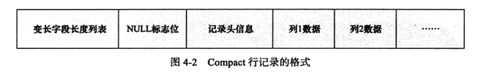

## 数据库 vs 实例

- 数据库：文件集合
- 实例：运行mysql的程序，包含后台线程和共享内存区
- 关系：集群模式下，一个数据库可以被多个实例共享，非集群模式下，数据库和实例一对一

- Mysql：单进程多线程架构

## mysql体系结构


```
Mysql组成：
1.连接池组件
2.管理服务和工具组件
3.SQL接口组件
4.查询分析器组件
5.优化器组件
6.缓冲组件
7.插件式存储引擎
8.物理文件

特性：
1.插件式表存储引擎，底层物理结构实现
存储引擎是基于表的，而不是针对数据库的，颗粒度更细，一个数据库的不同的表可以采用不同的存储引擎

存储引擎是可以自定义实现的，用户可以自己修改写自己的存储引擎

```

## Mysql存储引擎分类

- InnoDB存储引擎

  ```
  特性：
  1.支持事务
  2.高并发性：多版本并发控制MVCC
  3.实现了四种隔离级别，默认是REPEATABLE
  4.支持全文索引
  5.行锁设计
  6.支持外键
  7.提供一致性非锁定读
  ```

- MyISAM存储引擎

  ```
  特性：
  1.不支持事务
  2.缓冲池只缓冲索引文件，不缓冲数据文件
  3.支持全文索引
  4.在
  ```

## 连接mysql

- 连接的本质：一个连接进程和mysql实例通信，进程之间的通信

- 进程通信方法：TCP/IP、命名管道和共享内存、unix域套接字

- mysql的TCP/IP通信过程

  ```
  一个服务器上的mysql客户端通过ip访问在另一台服务器上的mysql实例
  mysql -h 192.168.0.101 -u root -p
  
  mysql实例收到连接请求，检查权限视图(user表)，看是否允许连接
  ```

## InnoDB体系架构


```
存储引擎组成内容：
1.内存池（是cpu和磁盘之间的桥梁）
缓存磁盘数据
缓存redo log

读的时候，先从缓冲池读，没读到先读入缓冲池，再返回给客户端
写的时候，先写入缓冲池，再异步刷到磁盘

包含内容：
数据页
插入缓冲
索引页
自适应哈希索引
锁信息
数据字典信息
重做日志缓冲
额外内存池

采用的算法：改进版LRU，midpoint设计

2.后台线程
Master Thread：异步从缓冲池把数据刷到磁盘

何时刷新，基于checkpoint技术

IO Thread：异步写IO请求
包含如下：
insert buffer thread-0
log thread-1
read thread-2\3\4\5
write thread-6\7\8\9

Purge Thread：undo页回收

Page Cleaner Thread：脏页刷新

```

## 重做日志缓冲刷新到文件的时间

```
1.Master Thread每一秒
2.每个事务提交时候
3.重做日志缓冲池剩余空间小于一半时
```

## 脏页

```
定义：
如果某个页的记录被改变了，那么页就是脏的，也就是脏页。需要刷新到磁盘。

```

## 重做日志redo log存在的意义是什么

```
缓冲池的页会被异步刷新到磁盘，如果刷新的时候，数据库宕机了，数据（脏页）岂不是丢失了。

这个时候就需要redo log出场。

事务提交的时候，先写重做日志，再修改页。这样即使宕机，也可以通过重做日志，恢复页数据
```

## Checkpoint技术

- 为何需要这个技术？

  每次有脏页就刷新，性能得多差,如果热点数据就几页，那性能得更差。

- 该技术解决的问题？

  1. 缩短宕机后数据库的恢复时间

     宕机的时候，不用恢复所有的重做日志，只需要对checkpoint之后的日志进行恢复，故数据库恢复时间缩短

  2. 缓冲池不够用的时候，将脏页刷新到磁盘

  3. 重做日志不可用时，刷新脏页

- 什么时候触发checkout

  ```
  Sharp Checkoutpoint：
  数据库关闭时，所有的脏页都会刷新回磁盘
  
  ```

  ```
  Fuzzy Checkoutpoint：
  只刷新一部分脏页数据到磁盘
  
  1.Master Thread Checkoutpoint：
  主线程每秒/10秒从缓存池刷新一定比例的脏页，异步的，不影响查询线程。
  
  2.Dirty Page too much Checkoutpoint：
  脏页太多，强制触发检查点
  根据参数innodb_max_dirty_pages_pct 脏页比例
  
  3.Flush_lru_list checkoutpoint：
  lru列表可用空间不够100，会刷新列表尾部的脏页
  
  4.async/sync flush checkoutpoint：
  重做日志不可用，强制刷新脏页到磁盘
  ```

## Master Thread的工作方式

- 随着版本升级性能提升

- 大致工作方式

  ```
  一个主线程，内部由多个循环相互切换组成
  
  包含：
  主循环 loop
  后台循环 background loop
  刷新循环 flush loop
  暂停循环 suspend loop
  ```

  - 主循环

    ```
    每秒做的事情(不一定是准确的一秒)：
    从缓存池把日志刷新到磁盘
    合并插入缓冲池的请求
    刷新脏页到磁盘，不一定执行
    如果没有用户活动，切换到后台循环
    
    每10秒做的事情：
    刷新100个脏页到磁盘，不一定执行
    合并最多5个插入缓冲
    从缓存池把日志刷新到磁盘
    删除无用的undo页
    刷新100个脏页到磁盘，一定执行
    
    其中，很多都可以可配置的：
    刷新脏页的个数
    插入缓冲合并个数
    ```

  - 后台循环

    ```
    删除无用的undo
    合并20个插入缓冲
    调回主循环
    可能跳转到刷新循环
    ```

  - 刷新循环

    ```
    如果没事做，就跳转到暂停循环
    ```

  - 暂停循环

## InnoDB关键特性

- 插入缓冲

  ```
  原理：先判断插入的非聚集索引页是否在缓存池中，如果是，直接插入，如果不是，先放入到一个Insert Buffer对象中，然后以一定的频率批量合并Insert Buffer对象和辅助索引节点
  
  适用条件：
  辅助索引
  索引不是唯一的
  
  数据结构：B+树
  
  改进版，对于insert，delete，update都有批量优化
  
  ```

- 两次写

  ```
  为何需要？
  重做日志损坏的情况下，数据库宕机，如何恢复？
  
  在缓存池和数据库之间添加了一层双写缓存，存了一份副本。
  ```

- 自适应哈希

  ```
  根据热点数据自动建立哈希索引，哈希时间复杂度为O(1)
  ```

- 异步IO

  ```
  同时发起多个IO请求，合并结果返回
  ```

- 刷新邻接页

  ```
  
  ```

## 存储引擎的关闭

- 可以指定是否等undo页都回收掉，是否等缓冲池都刷新回磁盘等

## 文件

包含哪些文件

```
参数文件
日志文件
socket文件
pid文件：mysql启动的时候，将进程id写入文件中
mysql表结构文件
存储引擎文件：记录和索引
```

### 参数文件

```
作用：在mysql启动的时候，读取参数文件启动，指定mysql启动的一些参数

存储：key=value 键值对

查看示例：
show variables like 'innodb_buffer%';

参数类型：
动态参数：启动后可以修改，支持全局修改和会话修改
静态参数：启动后不可以修改，修改会报修改失败

```

### 日志文件

```
包含：
1.错误日志 error log
作用：指导dba分析启动失败原因/警告信息

2.慢查询日志 show query log
通过参数long_query_time设置，默认10秒，开启，超过10秒会记录到文件，等于不记录
通过参数log_slow_queries开启慢查询，默认不开启
slow_log表也会记录慢查询日志,通过指定log_output为table即可
作用：分析慢查询，优化应用查询

3.二进制日志 binlog
记录update和delete请求信息
作用：可以根据binlog用来对数据进行恢复和复制

4.查询日志 log
记录所有的请求信息
```

### 表结构定义文件

```
每个表都有对应的表结构定义文件，文件以frm为后缀
```

### InnoDB表存储引擎文件

**表空间文件**

```
默认表的数据会存储在共享的表空间文件ibdata1上

如果开启了innodb_file_per_table，那么会给基于innodb存储引擎的表产生一个独立的表空间，存放表的数据，文件：表名.ibd，但是回滚信息，事务信息还是存放在共享表空间上。
```

**重做日志文件**

```
作用：
记录存储引擎的事务日志

写入方式：
->insert buffer->重做日志文件

组成：
最少一个重做日志文件组，每个组最少2个重做日志文件
```

## 表

### 主键的选择

```
主键选择的规则：
1.显式定义
2.第一个定义的非空唯一索引
3.以上都没有，引擎自动创建一个6个字节大小的指针

```

### 表逻辑存储结构


```
定位某一行:
共享表空间->段->区->页->row

区的大小：1MB
页的大小：innodb_page_size

```

**页**

```
数据页
undo页
系统页
事务数据页
...
```

## InnoDB行记录格式

```
有两种，Compact和Redundant。
Redundant是兼容老版本而存在的，目前默认是Compact

新增的行记录格式：
Compressed
Dynamic

如何指定：row_format=XXX
```

### Compact行记录格式



**一行一行记录是如何串起来的呢**

```
链表的形式串起来的，当前行记录加上下一个记录的偏移量就是下一个记录的起始位置。当前记录和偏移量存放在
记录头信息里。
```

```
除了上面显示的信息，还有隐藏列，事务ID列和回滚指针列
```

### Redundant行记录格式


### varchar类型真的可以存放65535字节么

```
1.不可以

2.建表的时候给varchar类型分配65535字节会报错,Column length too big for column 'name' (max = 16383); use BLOB or TEXT instead,因为除了存放数据，还有别的开销

3.65535的实际含义
官方文档中说的是varchar所有列的长度总和支持65535字节
而varchar(N) N的含义是当前列最大支持的字符的长度，而不是字节
```

### 列存放的长度太多，溢出了，数据是如何存放的，溢出的临界值是多少呢


```
溢出的时候：行记录里存放的是768字节的前缀和一个指向blob page的偏移量

溢出的临界值是8098长度
```

## 关系型数据库的约束

包含：

```
Primary Key
Unique Key
Foreign Key
Default
NOT NULL
```

### 约束的创建

- 表定义时
- alter table时

### 约束和索引的区别

```
约束是逻辑概念

索引是物理实现，是一种数据结构
```

### 约束的作用

```
在严格模式下，对于insert的数据，mysql会检查输入值，是否满足约束，不满足会报错
Column 'id' cannot be null

sql_mode=STRICT_TRANS_TABLES
```

### 用触发器来实现约束-我们一般很少用

```
触发器作用：
在insert update delete之前或者之后执行指定的命令，实现更灵活的约束和额外的动作

创建触发器的语法：
CREATE TRIGGER trigger_name 
BEFORE|AFTER
insert|update|delete
on table_name 
for each row;

例子：
create trigger usercash_update 
before 
update 
on usercash
for each row
begin
if new.cash-old.cash > 0 then
insert into usercash_err_log
select old.userid,old.cash,new.cash,now();
set new.cash = old.cash;
end if;
end;

```

### 用外键来实现约束-我们一般很少用

```
innoDB存储引擎支持外键约束，MyISAM不支持

但我们一般不定义外键约束
```

## 视图-我们一般很少用

### 作用

视图起的作用是实际表的影子，用来充当跟实际表操作的一个中间层，可以做一些校验或者事情，起到安全作用。

### Show tables

可以把视图一起查出来

### 创建视图

```
create view v_test
as 
select * from test where id < 10;
```

## 分区-我们一般很少用

### 分区的作用

```
将一个表分解为多个部分管理，在存储引擎的上一层完成的，跟存储引擎无关。
```

### 支持的分区类型

- RANGE：范围分区

  ```
  create table t (
  id int
  ) engine =innodb
  PARTITION by range(id)(
  PARTITION p0 values less than(10),
  PARTITION p1 values less than(20)
  );
  
  1.启用分区以后，表不再是一个ibd文件，而是2个
  
  2.不同的列值会插入不同的分区
  
  3.不在分区范围内的值插入会报错，可以定义最大分区，PARTITION p1 values less than maxvalue
  
  4.何时使用range分区：
  按照时间，2008年的一个分区，2009年的一个分区，explain select 2008年的时候会优化到只查询p2008分区
  ```

- LIST：具体的值列表分区

  ```
  create table t (
  a int,
  b int
  ) engine =innodb
  PARTITION by list(b)(
  PARTITION p0 values in (1,3,5,7,9),
  PARTITION p1 values in(0,2,4,6,8)
  );
  ```

- HASH：根据定义好的分区表达式均匀的分配在n个区间内

  ```
  create table t (
  a int,
  b datetime
  ) engine =innodb
  PARTITION by hash(year(b))()
  partitions 4
  ;
  
  取出b的年份值跟4取模，得到的就是分区index
  ```

- KEY：跟hash类似

### 子分区

- 在range和list分区的基础上再进行hash/key分区

## 索引和算法

### 优缺点

```
索引太多，磁盘使用率偏高，性能受损
索引太少，查询低下
```

### InnoDB支持的索引

```
B+树索引
全文索引
哈希索引:自适应的，根据表的使用情况，自动为表的热点数据生成哈希索引，复杂度O(1).
```

### 二分查找法

```
数组->有序化(升序/降序)->循环(取数组中间值和要查的值比较)
```

### B+树数据结构的演进(二叉树->平衡二叉查找树->B树+索引顺顺序访问->B+树)

- 二叉查找树

  

  

  ```
  定义:
  左子树的键值总是小于根的键值，右子树的键值总是大于根的键值
  
  效率：比顺序查找效率高
  
  缺点：如果构造的不好，也就是不平衡的话，效率会很低，继而需要引出平衡二叉查找树
  ```

- 平衡二叉树(AVL树)

  ```
  定义：
  二叉查找树+任意节点的两个子树的高度最大差为1
  
  效率：接近最优
  
  如何保持插入更新后的平衡：左旋 右旋等操作
  
  示例图：
  ```

  

- B+树

  ```
  介绍：
  平衡查找树
  所有的记录节点按照键值大小顺序存放在同一层，指针链接起来
  ```


```
包含：索引节点和叶子节点

如何保持平衡：
索引节点、叶子节点的拆分，旋转

为了避免拆分造成的消耗，引入了旋转，可以减少拆分的次数
```

### B+树的查找找到的不是具体的行

```
根据给定的键->定位到具体的页->读入内存->通过二分查找算法找到具体的行

而不是直接根据键->定位到具体的行
```

### B+树索引

```
树的高度：2-4层，耗时：0.02~0.04s

包含：聚集索引、辅助索引
```

### 聚集索引 vs 辅助索引的区别和联系

- 聚集索引

  ```
  1.每张表的主键构造一颗B+树，叶子节点存放的是行记录数据，索引包含数据
  
  2.每张表只有一个聚集索引
  
  3.逻辑上按照双向链表顺序存储，物理上就不用连续存储了
  
  4.特点：对于主键的顺序查找和范围查找速度特别快
  举个例子：
  explain select * from profile order by id limit 10;
  分析后并没有进行filesort
  
  ```

- 辅助索引

  

  ```
  1.除了主键以后的索引都是辅助索引(非聚集索引)
  
  2.数据存放：
  叶子节点不存储具体的行记录
  
  叶子节点存放了该索引的value和主键value，主键value可以通过聚集索引找到具体的行记录
  
  3.每张表可以有多个辅助索引，多个辅助索引B+树
  ```

- 区别

  ```
  聚集索引：叶子节点包含完整的记录行
  辅助索引：叶子节点不包含完整的记录行，包含辅助索引的value和一个对应的主键
  ```

- 联系

  ```
  辅助索引查到主键后，是通过聚集索引查找到具体的行记录的
  ```

### 一次查找的流程

```
select * from order where order_code = '23232';
```

### 有没有必要加索引

```
性别：不需要，一个表的数据50%为男性，50%为女性
姓名：需要，几乎没有重名，添加B+树索引，加速查询
```

### Cardinality值的作用

```
含义：该索引唯一值的统计数

作用：优化器会根据这个值决定用不用索引

特点：这个值是采样预估的，需要analyze table来刷新该值

应用：当cardinality/rows接近于1，这个时候这个索引才是高选择性的，好的索引
```

### 在线事务应用和在线分析应用索引的不同之处

```
在线事务应用：给事务相关的字段添加索引，比如订单号

在线分析应用：根据时间字段添加索引，
```

### 为何联合索引单独查询b列没有使用索引

### 联合索引

```
1.对表上多个列添加索引

2.使用到索引的情况
select a,b
select a

3.不使用索引的情况
select b

4.联合索引可以减少一次排序
explain select * from buy_log where userid =1 order by buy_date desc limit 3;
使用了联合索引，没有filesort
```


### 覆盖索引

```
1.含义：
从辅助索引中就可以得到查询的记录，不需要查询聚集索引，这个时候就称覆盖索引

2.作用：
对于统计，如果有辅助索引，那么select count(*) from table会直接走覆盖索引统计结果，不经过聚集索引统计

对于查询，要查询的值被辅助索引覆盖，就不需要查询聚集索引
```

### explain命令

### 索引失效的情况

### 哈希算法

- 原理

  采用hash函数，求key对应的槽位，相同hash值的情况叫碰撞，采用链表链起来。

- 哈希函数的要求

  比较高的散列性，最好不要碰撞

- 哈希算法的常见应用

  hashMap等

### InnoDB支持全文索引

## mysql中的锁-解决事务的隔离性

- InnoDB存储引擎的行级锁
- 内存缓冲池LRU列表的锁
- MyISAM存储引擎的表级锁

### InnoDB存储引擎的行级锁

- 共享锁：S lock
- 排他锁：X lock


```
事务T3要获取行r的X锁，需要等待事务T1、T2释放S锁
```

### InnoDB存储引擎的表级别意向锁

- 意向共享锁 IS lock，事务想要获得一张表某几行的共享锁
- 意向排他锁 IX lock，事务想要获得一张表某几行的排他锁
- 意向锁存在的意义？

### 如何查看innoDB的锁情况

- Innodb_trx表：查看事务状态，是否阻塞
- Innodb_locks表：查看事务对应的锁信息
- innodb_lock_waits表：查看是哪组事务和锁，阻塞了哪组

### 非锁定读是啥意思

```
含义：某行加了X锁，查询请求不会被阻塞，通过读undo页里的数据直接返回(跟共享锁和排他锁区分开)

作用：提高并发性

MVCC的由来：由于undo有多次历史记录，所以是多版本的，也就是MVCC，
multi version concurrency control
```

### 事务隔离级别和非锁定读的对应关系

| 事务隔离级别                             | 读方式   | 快照版本的选择     |
| :--------------------------------------- | -------- | ------------------ |
| repeatable read(mysql默认的事务隔离级别) | 非锁定读 | 事务开始时的undo行 |
| read committed                           | 非锁定读 | 最新undo行         |
|                                          |          |                    |
|                                          |          |                    |

### 锁定读

```
select ... for update 对读取的行加X锁
select ... lock in share mode 对读取的行加S锁
```

###  锁的算法

- Record lock ：单个行记录上的锁
- Gap lock：间隙锁，锁定一个范围，不包含记录本身
- Next-key lock:GapLock + Record lock,目的为了解决幻像问题当查询的列是唯一索引的时候，会降级为Record lock

### 幻像问题-不可接受，但是行级锁可以会规避它

- 定义：在同一个事务下，连续执行两次同样的sql，可能导致不同的结果，也就是违背了事务的隔离性，当前事务可以看到其他事务的结果。
- 如何解决：在repeatable read事务隔离级别下，默认的行锁算法是Next-key lock，也就是间隙锁+行锁，这样范围内的操作都会被阻塞，也就不会产生当前事务看到其他事务的结果。

### 脏读-一般不可接受，所以不能设置为Read uncommitted隔离级别

- 含义：事务对缓冲池中行记录的修改，没有提交的时候，被其他事务读到了，违背了隔离性。
- 何时会发生：事务隔离级别设置为Read uncommitted的时候

### 不可重复读-可以接受

- 含义：当前事务可以读到其他事务已经提交的结果，但是也违背了隔离性，所以叫不可重复读
- 何时会发生，事务隔离级别设置为Read committed的时候
- 如何解决：事务隔离基本设置为Read repeatable，这个时候的锁算法是next-key lock。解决了不可重复读问题，也即幻像问题。

### 为何数据库默认的事务隔离级别是Read repeatable

1. 采用了next-ket lock行锁算法，避免了幻像问题、脏读问题

### 更新丢失了？

- 场景：一个用户在两个终端操作转账，查到的余额都是10000，第一个终端转了9000，第二次终端转了1，最后余额是9999。

- 如何解决？

  1.查询的时候就加排他X锁

  select * from table where user= xxx for update.

  2.乐观锁，利用version号

### 等待锁超时了，事务会回滚么

```
1.可以通过参数在启动时候设置，innodb_rollback_on_timeout=on

2.默认是off，不会回滚

3.超时机制，innodb_lock_wait_timeout指定
```

## 事务

- 原子性:a
- 一致性:c
- 隔离性:i
- 持久性:d

```
innoDB满足ACID
oracle不满足隔离性，采用的是Read committed数据库隔离级别
```

### InnoDB支持的事务

- 扁平事务
- 带有保存点的事务
- 链事务
- 分布式事务：所有节点要么都成功，要么都失败

### InnoDB事务的实现原理

- redo-保证了持久性D

  ```
  事务提交->先将日志写入重做日志缓冲->异步刷到重做日志文件
  
  通过innodb_flush_log_at_trx_commit控制何时刷到文件
  ```

- undo-保证了一致性，当需要回滚事务的时候用undo，另一个作用是MVCC

  ```
  1.undo产生的时候会伴随着产生redo log
  ```

- purge

  ```
  delete 和 update的真正物理操作是延迟在purge中完成的，当时执行的时候只是标记为delete。
  
  purge会判断是否还有事务引用，没有就可以真正执行。
  ```

- group commit

### 事务控制语句

```
1.默认事务是自动提交的

2.显式开启事务
begin

3.提交事务
commit

4.回滚事务
rollback

5.设置事务隔离级别
set transaction
```

### 隐式commit的sql语句有哪些

```
ddl语句：create alter drop等
```

### 数据库事务统计 TPS QPS

```
1.TPS 每秒事务处理的能力
tps=(commit+rollback)/time

2.QPS 每秒请求数
```

### 分布式事务

```
1.XA事务的隔离级别必须是serializable

2.XA事务的组成：
一个事务管理器+一个应用程序+多个资源管理器

3.XA事务的协议：
两阶段提交协议
第一阶段：所有资源管理器告诉事务管理器它们准备好了
第二阶段：事务管理器告诉资源管理器执行ROLLBACK还是COMMIT

4.单个节点运行分布式事务
XA start 'a';

insert into z select 11;

XA end 'a';

XA PREPARE 'a';

XA commit 'a';
```

### Java事务API支持mysql分布式事务

```
int ret2 = xaRes2.prepare(xid2);
int ret1 = xaRes1.prepare(xid1);

if (ret1 == XAResource.XA_OK && ret2 == XAResource.XA_OK) {
	xaRes1.commit(xid1,false);
	xaRes2.commit(xid1,false);
}
```

### Mysql内部的XA事务

- binlog和重做日志要么都成功，要么都回滚

### 一个不好的事务习惯

- 不好：在循环中提交事务，每一次都会记录一次重做日志
- 如何改进：在循环开始前就开启事务，所有的循环一次性提交，只会记录一次重做日志

### 事务自动提交

### 长事务

- 如何改进：分解为批量的小事务

## 备份数据

### 备份分类

- 热备份：在线备份
- 冷备份：停库备份
- 温备份：在线备份，对当前操作有所影响

## 常用参数配置

```
缓冲池大小
innodb_buffer_pool_size

缓冲池实例的个数(提高并发)
innodb_buffer_pool_instances

重做日志缓冲大小
innodb_log_buffer_size

undo回收线程个数（提高并发）
innodb_purge_threads
```

## 常用sql

```
客户端发起请求连接mysql实例
mysql -h host -u name -p ***

查看当前mysql支持的存储引擎
show engines;

查看当前innoDB的状态
show engine innodb status;

查看数据库所有参数
show variables;

查看数据库某个参数
show variables like 'xxx%';

添加索引(可以对列的的一部分进行索引)
alter table table_name add index index_name [index_type] (col_name,...);

删除索引
alter table table_name drop primary key | drop index index_name;

查看表的索引
show index from table_name;

设置数据库隔离级别：
set transaction isolation level XXX;
```

