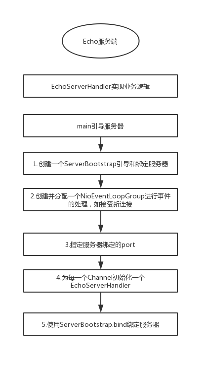
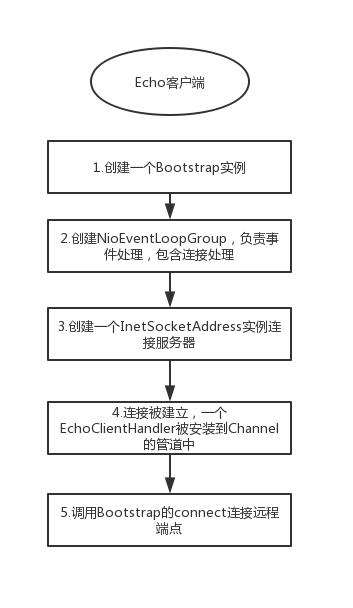

## 1 Netty-异步和事件驱动

- 同时支持15万用户并发在线，如何做？

- ServerSocket

  ```
  ServerSocket的accept()会阻塞，直到有一个请求进来。
  该方式：需要为每个请求创建一个Thread
  
  普通IO
  ```

- java.nio包

  ```
  NIO：非阻塞IO
  selector：一个线程可以处理多个请求
  ```

  

- Netty的核心组件

  ```
  1.Channel：
  看作是传入或者传出数据的载体。可以被打开或者被关闭，连接或者断开连接。
  
  2.回调
  
  3.future
  netty实现了自己的future-ChannelFuture，比java nio的更好用
  
  4.事件和ChannelHandler
  ```

## 2 你的第一款Netty应用程序

- Echo客户端服务端，请求-响应交互模式

- 服务器-思维导图

  

- 客户端-思维导图

  

## 3 Netty的组件和设计

- Channel-Socket，封装了socket


## 4 传输

- 向客户端say hi的实现演进

  - jdk 阻塞IO实现

    ```
    
    ```

  - jdk 非阻塞IO实现

  - netty 阻塞IO实现

  - netty 非阻塞IO实现


## 5 ByteBuf

- netty的ByteBuf vs jdk ByteBuffer
- ByteBuf-字节容器，网络数据的基本单位是字节


## 8

- bind() --- > doBind() 一般的框架都喜欢在doXXX做具体的事件
- 