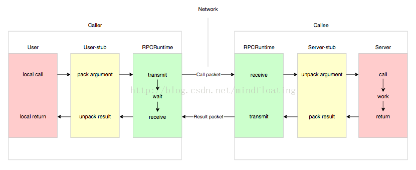
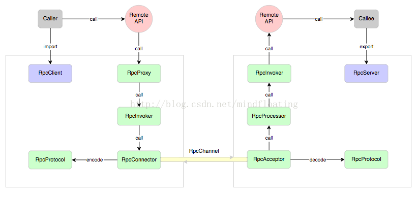
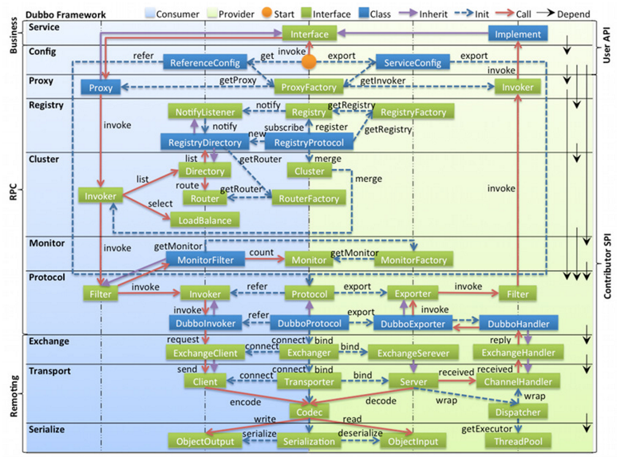

## RPC

```
Remote Procedure Call：进程间通信方式
不需要显式编写远程调用的细节，用本地调用的方式实现远程调用能力
```

## RPC过程



```
过程：
1.user发起一个远程调用，通过本地调用user-stub.
2.user-stub负责将调用的接口、方法、参数通过约定的协议进行编码，并通过本地的RPCRuntime实例传输到远端的实例

3.远端RPCRuntime实例收到请求后，交给server-stub进行解码后发起本地端调用
4.调用结果返回user端
```

## RPC调用分类

```
1.同步调用
2.异步调用后回调
3.异步调用后不回调
```

## RPC过程细化



```
1.客户方通过RpcClient引入远程接口方法
2.调用委托给RpcProxy
3.代理把请求转发给RpcInvoker去执行
4.RpcInvoker通过RpcConnector维持与服务端的通道，并使用RpcProtocol执行协议编码，将编码后的消息通过通道发送给服务方

5.服务方接收器RpcAcceptor收到客户端的请求，使用RpcProtocol进行解码将调用信息传递给RpcProcessor
6.RpcProcessor负责线程池管理，控制调用过程，委托给RpcInvoker实际执行调用，通过反射技术调用指定接口的方法
7.返回给客户端
```

## Dubbo架构图



## Dubbo rpc过程

```
客户端发起调用->

调用了代理层RpcProxy，RpcProxy调用集群组件cluster，调用Directory、Router、LoadBalance，分别实现服务高可用、智能路由、负载均衡，找到一个Invoker发起调用->

执行Invoker的invoke()->

protocol层通过filter做拦截过滤，调用协议层的invoke()->

具体的协议实现类请求ExchangeClient组件发起请求序列化后的数据->
```

```
服务端收到请求->

反序列化数据->

找到本地的Exporter,触发invoke->

过滤器处理->

invoker代理层调用本地接口->

返回序列化数据
```

## Dubbo收到服务端返回结果异步转同步机制与超时处理

```
发起调用：
DubboInvoker.doInvoke(){
	return (Result) currentClient.request(inv, timeout).get();
}

DefaultFuture.get(){
	//1.isDone判断是否有返回
	//2.没返回lock.lock()获取锁
	//3.while(isDone())循环判断，done.await(timeout, TimeUnit.MILLISECONDS);
	//4.有返回，或者请求超时跳出循环
	//5.最后做判断
}

DefaultFuture.doReceived(){
	//返回不为空，done.signal()
}
```

