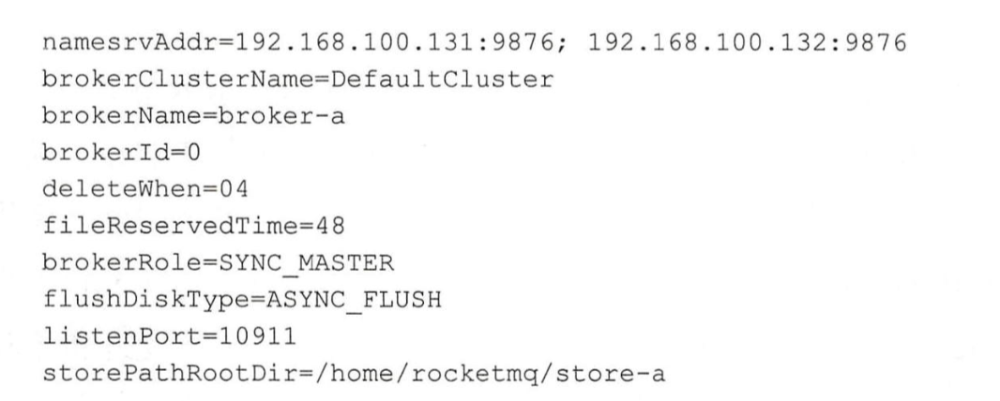

# 1.快速入门

## MQ的作用

### 解耦

```
强依赖-弱依赖，下游系统故障，可以等恢复后重试
```

### 消峰

```
大流量平躺到一段时间处理，节约服务器资源，不需要上更高配置的服务器
```

### 消息分发

```
一份消息，可以分发给很多需求方去消费，各自维护自己的offset
```

### 保证最终一致性

### 动态扩容

## MQ核心组件启动顺序

```
NameServer -> Broker
producer 发消息
consumer 收消息
```

# 2.生产环境下的配置和使用

## MQ高可用如何保证

```
NameServer集群
Broker集群，并且开启主从
Producer集群
Consumer集群
```

## Topic和MessageQueue

```
topic主题
topic可以配置多个MessageQueue，可以并行向MessageQueue发消息，也可以并行消费
```

## Broker配置



```
master和slave的brokerName一样，brokerId=0是master，大于0是slave
```

```
同步消息机制：
SYNC_MASTER 主从同步完成，才返回发送成功
```

```
刷盘策略：
SYNC_FLUSH 
ASYNC_FLUSH 消息写入page_cache就返回成功
```

## 发消息流程

```
创建一个producer

设置GroupName

设置NameServer地址

构建Message，包含topic等信息

发送Message
```

## 消费消息流程

```
创建Consumer

设置GroupName

设置NameServer地址

订阅topic，tag

注册消息拿到以后的处理方法
```

# 3.用适合的方式发送和接收

## DefaultMQPushComsumer

```
长轮训从Broker拉取消息
```

## pull

```
由客户端自己处理何时拉取消息，拉取到消息消费
```

## 发送消息的方式

### 同步发送

### 异步发送

### 单向发送

## 发送延迟消息

```
构建Message的时候,setDelayTimeLevel
```

## 发送消息到某个MessageQueue

```
send(Message msg, MessageQueueSelector selector, Object arg)
```

## offset的存储

### DefaultMQPushComsumer在广播模式下

```
采用LocalFileOffsetStore使用json格式存在本地
```

### DefaultMQPushComsumer在集群模式下

```
采用RemoteBrokerOffsetStore存在broker
```

### DefaultMQPullConsumer

```
由客户端自己维护offset，需要做好持久化
```

# 4.分布式队列的协调者

## NameServer不持久化

## 集群状态的存储结构

```
RouteInfoManager{
		//
	  private final HashMap<String/* topic */, List<QueueData>> topicQueueTable;
	  //同一个brokerName对应的机器，主从
    private final HashMap<String/* brokerName */, BrokerData> brokerAddrTable;
    //同一个Broker集群对应的BrokerName
    private final HashMap<String/* clusterName */, Set<String/* brokerName */>> clusterAddrTable;
    //这台机器上的broker实时信息
    private final HashMap<String/* brokerAddr */, BrokerLiveInfo> brokerLiveTable;
    //这台机器上的过滤服务信息
    private final HashMap<String/* brokerAddr */, List<String>/* Filter Server */> filterServerTable;
}
```

## NameServer的定时任务

```
定时检查不活跃的broker，并移除，根据broker向nameServer发送的心跳更新时间戳
```

## 创建Topic

```
CODE：UPDATE_AND_CREATE_TOPIC
Broker收到请求后：
1.更新本地broker信息到文件
2.注册到NameServer
```

## 通信

```
第一层：RemotingService
RemotingService{
	start();
	shutdown();
	registerRPCHook(RPCHook rpcHook)
}

第二层：
RemotingServer RemotingClient extends RemotingService{
	
}

第三层：
NettyRemotingClient NettyRemotingServer extends NettyRemotingAbstract{

}

模块之间通信通过发送统一的RemotingCommand完成
```

# 5.消息队列的核心机制

## 磁盘存储如何优化

### 零拷贝技术

```
mmap，省去了内核态切换到用户态的消耗，通过MappedByteBuffer实现
```

## 消息存储结构

```
CommitLog 消息真正的物理存储文件
加锁顺序写
随机读，但是利用了pagecache机制，作为cache存到内存中

ConsumeQueue 消息的逻辑队列，每个Message Queue都对应一个ConsumeQueue文件，存储commitlog文件的offset。

IndexLog 消息索引文件，加速消息查询
```

## 高可用机制

### 主从

```
Master：读写
Slave：只读
```

### 消费端高可用

```
当master挂掉以后，comsumer仍旧可以从salve读消息
```

### 发送端高可用

```
把topic的MessageQueue创建在Broker集群上的不同机器上
```

## 刷盘方式

### 异步刷盘

```
消息写入内存pagecache就返回写入成功
```

### 同步刷盘

```
消息写入内存pagecache，通知刷盘线程刷盘，刷盘成功，唤醒等待线程，返回消息写成功
```

## 主从同步方式

### 同步复制

```
master和salve都写入成功，返回给客户端写入成功
```

### 异步复制

```
master写入成功，就返回给客户端写入成功
```

## 线上配置经验

```
刷盘方式：异步刷盘，性能高
主从同步：同步复制，保证数据不丢失，故障后切换不丢失消息
```

# 6.可靠性优先的使用场景

## 全局顺序消息

```
topic的读写队列设置为1，producer和consumer并发设置也是1，牺牲了高并发
```

## 部分顺序消息

```
发送端：同一个业务ID的消息发送到同一个Message Queue，MessageQueueSelector
消费端：从同一个Message Queue读取到的消息不被并发处理，MessageListenerOrderly保证，同一个Message Queue消费消息被上锁，不会被并发消费
```

## 消息重复投递

```
消费端幂等，多次调用和一次调用结果一样
维护一个消息记录，消息之前先查询是否已经消费
```

## 消息优先级如何解决

```
通过单独开一个topic，让某种类型的消息不会因为消息太多一直得不到处理

通过对一个topic创建足够的MessageQueue，不同订单扔进不同的MessageQueue
```

# 7.吞吐量优先的使用场景

## Tag

```
Tag：Broker基于tag进行消息过滤，不需要读取消息体的内容。

ConsumeQueue的存储结构:
8字节的CommitLog的offset+4字节的大小+8字节的tag的hashCode


```

## SQL表达式过滤

```
借助sql表达式consumer可以实现复杂的过滤逻辑

consumer.subscribe("topic",MessageSelector.bySql("a between 0 and 3"));

```

## 如何提高Consumer消费能力

### 增加消费者实例，不要超过read queue的数量

```
集群模式下增加消费者实例
```

### 提高单个consumer实例中的线程数

```
setConsumeThreadMax
setConsumeThreadMin
```

### 批量方式消费

```
setConsumeMessageBatchMaxSize

业务逻辑中sql操作一次10条数据
```

