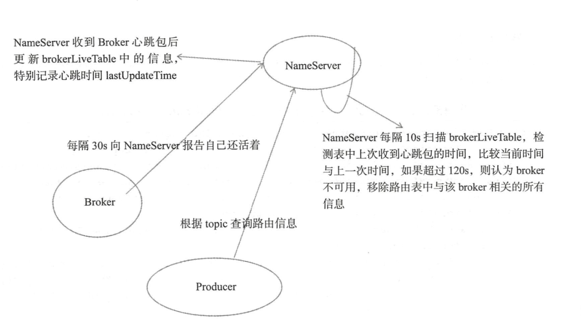
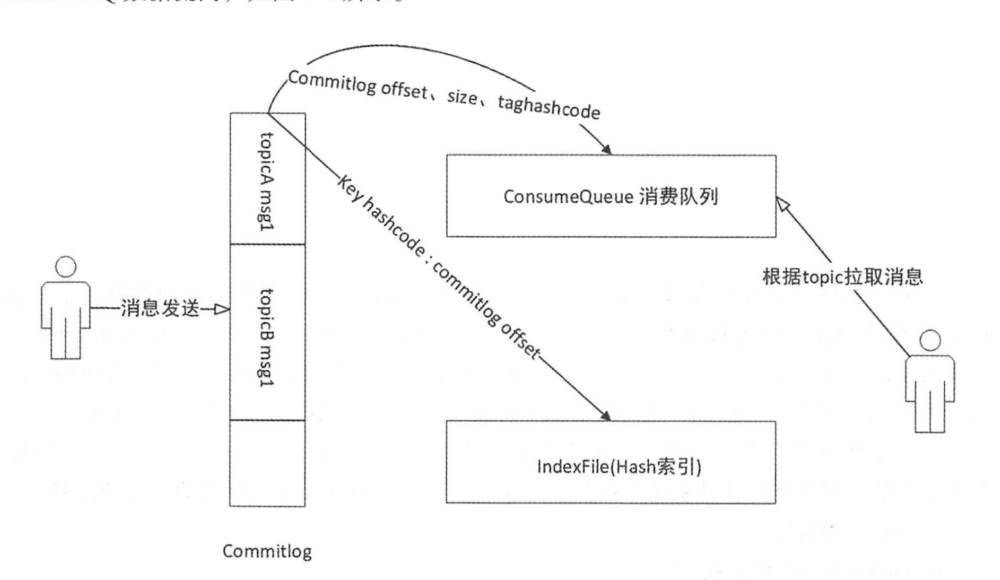

## 如何阅读源代码

1. 下载源代码
2. 配置环境变量启动参数，找到启动入口，debug运行

## 调试源代码

- 启动Nameserver：修改配置文件，执行NamesrvStartup的main，启动nameserver。
- 启动Broker：修改配置文件，执行BrokerStartup的main，启动Broker。
- 测试producer：example下的quickstart里的Producer修改nameServer地址。
- 测试consumer：example下的quickstart里的Consumer修改nameServer地址。

## 源代码目录结构

```
broker：broker模块(broker启动进程)
client：消息客户端，包含生成者，消费者
common：公用包
example：示例代码
filter：消息过滤相关基础类
filtersrv：消息过滤服务器相关实现类(filter启动进程)
logappender：日志实现相关类
namesrv：NameServer实现相关类(NameServer启动进程)
openmessaging：消息开发标准
remoting：远程通信模块，基于netty
srvutil：服务器工具类
store：消息存储实现类
test：
tools：

```

## 设计目标

- 架构模式
- 顺序消息
- 消息过滤
- 消息存储
- 消息高可用性
- 消息到达低延迟
- 确保消息必须被消费一次
- 回溯消息
- 消息堆积
- 定时消息
- 消息重试机制

## NameServer启动流程

1. 解析配置文件

   ```
   System存储kv属性。
   解析配置填充NamesrvConfig\NettyServerConfig
   ```

2. 创建NamesrvController，核心控制器

   ```
   加载kv配置，初始化controller。
   
   创建nettyServer网络处理对象
   
   注册处理器:DefaultRequestProcessor，用于路由管理
   
   初始化的时候，开启了两个定时任务，心跳服务。
   一个检测不活跃的broker，移除；一个打印kv配置。
   
   注册JVM的钩子函数，在JVM关闭之前先关闭controller，关闭里面的线程池，释放资源。
   
   ```

## NameServer路由管理

- 路由信息

  ```
  HashMap<String(topic),List<QueueData>> topicQueueTable;
  HashMap<String(brokerName),BrokerData> brokerAddrTable;
  HashMap<String(clusterName),Set<String(brokerName)>> clusterAddrTable;
  HashMap<String(brokerAddr),BrokerLiveInfo> brokerLiveTable;
  HashMap<String(brokerAddr),List<String>> filterServerTable;
  ```

- 路由注册

  ```
  broker发送心跳包请求注册到NameServer：
  broker启动，向集群中所有的NameServer发送心跳包，NameServer收到心跳包会更新brokerLiveTable中的上次更新时间，如果120s没收到，NameServer就移除该broker。
  
  NameServer处理心跳包：
  DefaultRequestProcessor收到请求code为:RequestCode.REGISTER_BROKER，调用
  RouteInfoManager.registerBroker注册broker
  
  设计亮点：
  Broker状态存储在brokerLiveTable中。NameServer每收到一个心跳包，
  将更新brokerLiveTable中关于Broker的状态信息以及路由表(topicQueueTable\brokerAddrTable\brokerLiveTable\filterServerTable)。更新路由表使用了读写锁，可以并发读，高效。NameServer处理Broker心跳包是串行，一次只允许一个。
  ```

- 路由删除

  ```
  两种方式：
  1.NameServer会每隔10秒扫描brokerLiveTable，检测上次心跳与服务器时间，相差大于120s，移除该broker，更新路由信息表
  
  2.brokder正常关闭，执行unregisterBroker，发送请求UNREGISTER_BROKER。
  DefaultRequestProcessor收到请求code为：UNREGISTER_BROKER，调用RouteInfoManager.unregisterBroker()
  
  问题：如果broker失效，要等120s，producer拉取的有无效的broker，会导致发送失败，rocketmq是如何解决的呢？---看发送机制
  ```

- 路由发现

  ```
  由客户端定时拉取，请求code，RequestCode.GET_ROUTEINTO_BY_TOPIC
  ```

- 路由发现注册删除机制流程

  

## Broker启动流程—和NameServer启动流程类似

1. 解析配置文件

   ```
   解析配置填充BrokerConfig\NettyServerConfig\NettyClientConfig\MessageStoreConfig
   ```

2. 创建BrokerController，核心控制器

   ```
   初始化controller
   
   注册处理器registerProcessor()-SendMessageProcessor/pullMessageProcessor/queryProcessor/...
   
   发送心跳包注册到集群中所有的NameServer
   
   注册JVM的钩子函数，在JVM关闭之前先关闭controller，关闭里面的线程池，释放资源。
   ```

## 消息结构

- Message

  ```
  public class Message implements Serializable {
      private static final long serialVersionUID = 8445773977080406428L;
  	//主题
      private String topic;
      //
      private int flag;
      //扩展属性：
      //keys 用于索引
      //tags 用于过滤消息
      private Map<String, String> properties;
      //消息体
      private byte[] body;
      private String transactionId;
  }    
  ```

## Producer启动流程

- DefaultMQProducer

  ```
  public class DefaultMQProducer implements MQProducer{
      private volatile int defaultTopicQueueNums = 4;
      private int sendMsgTimeout = 3000;
      private int compressMsgBodyOverHowmuch = 1024 * 4;//超过4M压缩
      private int retryTimesWhenSendFailed = 2;//一共三次
      private int retryTimesWhenSendAsyncFailed = 2;
      
      //属性
      protected final transient DefaultMQProducerImpl defaultMQProducerImpl;
  
  }
  
  public interface MQProducer extends MQAdmin{}
  
  三种发送方式：
  同步发送
  public SendResult send()
  异步发送
  public void send(Message msg,SendCallback sendCallback)
  单向发送：不需要关心发送成功还是失败
  public void sendOneway(Message msg)
  ```

- 启动流程

  ```
  委托关系链路：defaultMQProducer->defaultMQProducerImpl->mQClientInstance
  
  1.defaultMQProducer.start()->
  defaultMQProducerImpl.start()->
  
  2.MQClientManager.getInstance()->
  创建mQClientInstance放入factoryTable中->
  
  ConcurrentMap<String/* clientId */, MQClientInstance> factoryTable
  
  3.mQClientInstance.registerProducer()->
  将producer放入producerTable中管理->
  
  4.mQClientInstance.start()->
  this.mQClientAPIImpl.start();
  this.startScheduledTask();(获取namesrv，更新路由信息，发送心跳到broker)
  this.pullMessageService.start();
  ```

## 消息发送过程

- 过程

  ```
  public SendResult send(Message msg)
  
  委托链路:defaultMQProducer->defaultMQProducerImpl->mQClientInstance->mqClientAPIImpl->remotingClient->REQUEST_CODE
  
  1.Validators.checkMessage(msg, this);消息长度主题等的验证->
  
  2.查找主题路由信息tryToFindTopicPublishInfo->
  
  3.感觉路由信息选择消息队列
  MessageQueue mqSelected = this.selectOneMessageQueue(topicPublishInfo, lastBrokerName);->
  
  4.钩子函数检测
  如果有，消息发送前，发送后都会执行
  
  5.发送消息
  defaultMQProducerImpl.sendKernelImpl->mQClientInstance.getMQClientAPIImpl().sendMessage
  RequestCode.SEND_MESSAGE
  ```

## 消息处理流程

- 过程

  ```
  broker的SendMessageProcessor处理器：
  
  1.检查消息发送是否合理msgCheck()
  
  2.检查消息是否超过最大重试次数，如果超过，进入DLD延迟队列。
  
  3.存储消息
  brokerController.messageStore.putMessage(msg);
  
  
  ```

## 批量消息发送

- 过程

  ```
  1.batch(Collection<Message> msgs)构建MessageBatch对象
  
  MessageBatch extends Message {
      //属性
      List<Message> messages;
  }
  
  2.之后流程跟单条消息一样
  
  ```

## 消息存储整体流程



```
存储链路：producer---发msg--->commitlog--->异步转发到ConsumerQueue(一个主题有多个ConsumerQueue)

CommitLog:
所有的消息都存储在CommitLog

ConsumerQueue:
消息到了CommitLog异步转发到Queue

IndexFile:
消息索引文件，存储key和offset的对应关系

事务状态服务：

定时消息服务：
```

## 消息存储实现类数据结构

```
DefaultMessageStore{
    private final MessageStoreConfig messageStoreConfig;
    private final CommitLog commitLog;
    ConcurrentMap<String/* topic */, ConcurrentMap<Integer/* queueId */, ConsumeQueue>> consumeQueueTable;
    //...
}
```

## 存储流程

- SendMessageProcessor执行brokerController.messageStore.putMessage(msg)，流程：

  ```
  1.检查消息存储是否可用，以下情况都不可用：
  broker不可用
  broker的角色是SLAVE
  消息主题长度超过256个字符
  消息属性长度超过65536个字符
  
  2.获取当前可以写入的CommitLog文件
  MappedFile mappedFile = this.mappedFileQueue.getLastMappedFile();
  
  mappedFileQueue是文件夹列表，每个MappedFile大小为1G，一个文件存满以后创建下一个文件，以第一个消息的物理偏移量作为文件MappedFile的名字，可以根据消息的偏移量快速的定位到消息存储在哪个文件。
  
  3.申请putMessage的锁(两种锁)
  putMessageLock.lock();存储消息是串行的。
  
  4.设置消息的存储时间，检查文件是否存在，不存在创建。
  
  5.创建全局唯一消息id---16位->
  MessageDecoder.createMessageId(this.msgIdMemory, msgInner.getStoreHostBytes(hostHolder), wroteOffset);
  
  6.将消息内容存储到ByteBuffer中->
  
  7.解锁putMessage锁
  
  8.处理刷盘
  ```

## 存储文件的数据结构

- MappedFileQueue：是MappedFile的管理容器

  ```
  MappedFileQueue{
      private final String storePath;
      private final int mappedFileSize;//单个文件的存储大小
      private final CopyOnWriteArrayList<MappedFile> mappedFiles;
      private final AllocateMappedFileService allocateMappedFileService;
      private long flushedWhere = 0;
      private long committedWhere = 0;
  }
  ```

- MappedFile：

  ```
  MappedFile{
  	//属性
  	
  	//方法
      flush(){};
  }
  ```

## 都有哪些存储文件

- CommitLog文件
- ConsumerQueue文件
- Index索引文件
- checkpoint文件

## 实时更新消息消费队列与索引文件

- 当消息被存储到CommitLog文件时，需要实时的更新消息消费队列与索引文件

- 如何更新

  ```
  DefaultMessageStore {
      start{
          this.reputMessageService.start();
          //每间隔1s，调用doReput()方法->
          DefaultMessageStore.this.doDispatch(dispatchRequest);->
          依次执行两个更新请求
          CommitLogDispatcherBuildIndex&
          CommitLogDispatcherBuildConsumeQueue
      }
  }
  ```

- 索引文件更新

  ```
  CommitLogDispatcherBuildIndex#dispatch:
  ```

## 文件刷盘机制

- 配置刷盘方式:broker flushDiskType

- broker同步刷盘

  ```
  消息追加到内存映射文件后，立即将数据从内存刷写到磁盘文件。
  
  handleDiskFlush()->
  FlushDiskType.SYNC_FLUSH情况下->
  发送刷盘GroupCommitRequest->
  阻塞等待同步任务完成->CountDownLatch.await->doCommit()->flush->fileChannel.force一次处理一批request->刷完后唤醒countDownLatch.countDown()
  返回给调用方producer
  ```

  - CountDownLatch在刷盘中的应用

  ```
  CountDownLatch的使用：
  构造发送请求->初始化countDownLatch的count为1 
  发送刷盘请求并阻塞等待->countDownLatch.await(timeout, TimeUnit.MILLISECONDS),阻塞等待5s->
  刷完以后调用wakeupCustomer，执行countDownLatch.countDown()减一count，为0->
  阻塞结束，继续后续流程
  ```

- broker异步刷盘

  ```
  transientStorePoolEnable允许短暂存储true的情况：
  1.FlushRealTimeService唤醒，
  
  
  transientStorePoolEnable允许短暂存储false的情况：
  ```

## 过期文件删除机制

- 非当前写文件72小时以后被认为过期，不关心消费没有，删除

- DefaultMessageStore.start->

  ```
  scheduleAtFixedRate：DefaultMessageStore.this.cleanFilesPeriodically();
  ```

## 消费者启动过程

- 消费入口

  ```
      public static void main(String[] args) throws MQClientException {
          DefaultMQPushConsumer consumer = new DefaultMQPushConsumer("please_rename_unique_group_name_3");
  
          consumer.setConsumeFromWhere(ConsumeFromWhere.CONSUME_FROM_FIRST_OFFSET);
  
          consumer.subscribe("TopicTest", "TagA || TagC || TagD");
  
          consumer.registerMessageListener(new MessageListenerOrderly() {
              AtomicLong consumeTimes = new AtomicLong(0);
  
              @Override
              public ConsumeOrderlyStatus consumeMessage(List<MessageExt> msgs, ConsumeOrderlyContext context) {
                  context.setAutoCommit(true);
                  System.out.printf("%s Receive New Messages: %s %n", Thread.currentThread().getName(), msgs);
                  this.consumeTimes.incrementAndGet();
                  if ((this.consumeTimes.get() % 2) == 0) {
                      return ConsumeOrderlyStatus.SUCCESS;
                  } else if ((this.consumeTimes.get() % 3) == 0) {
                      return ConsumeOrderlyStatus.ROLLBACK;
                  } else if ((this.consumeTimes.get() % 4) == 0) {
                      return ConsumeOrderlyStatus.COMMIT;
                  } else if ((this.consumeTimes.get() % 5) == 0) {
                      context.setSuspendCurrentQueueTimeMillis(3000);
                      return ConsumeOrderlyStatus.SUSPEND_CURRENT_QUEUE_A_MOMENT;
                  }
  
                  return ConsumeOrderlyStatus.SUCCESS;
              }
          });
  
          consumer.start();
          System.out.printf("Consumer Started.%n");
      }
  ```

- 数据结构

  ```
  DefaultMQPushConsumer implements MQPushConsumer{
  	//属性,委托给defaultMQPushConsumerImpl来实现
      DefaultMQPushConsumerImpl defaultMQPushConsumerImpl;
  }
  
  MQPushConsumer extends MQConsumer{}
  ```

- 消费者启动流程

  ```
  consumer.start()->
  
  defaultMQPushConsumerImpl.start()->
  
  copySubscription()：构建主题订阅信息，有两个来源，一个是defaultMQPushConsumer.getSubscription()方法，一个是订阅重试主题，消息重试是以消费组为单位的->
  
  初始化MQClientInstance，消息重新负载实例->
  
  初始化消息进度offsetStore，集群消费消息进度保存在broker上，广播消费消息进度保存在消费端本地->
  
  创建消费线程->
  
  向MQClientInstance注册消费者->
  
  启动MQClientInstance实例->
  
  ```

- 生产者启动流程 vs 消费者启动流程

  ```
  跟Producer的启动流程设计思路神似，最终都委托给MQClientInstance->MQClientAPIImpl->RemotingClient，生产者和消费者都属于client，broker属于server，所以broker调用的是remotingServer
  ```

  ```
  在一个 NM 中的 所有消费者、生产者持有同一个 MQClientlnstance, MQClientlnstance 只会启动一次。
  ```

## 消费模式

- 集群模式：主题下的同一条消息只允许被其中一个消费者消费
- 广播模式：主题下的同一条消息将被集群内的所有消费者消费一次

## 消息服务器和消费者消息传送方式

- 拉模式

- 推模式（封装了拉）

  ```
  MQClientInstance中启动了PullMessageService:
  
  基本流程：
  1.客户端封装消息拉取请求
  封装为ProcessQueue对象
  
  2.进行消息拉取流控
  ProcessQuquq处理的消息条数超过threshold=1000就触发流控，放弃本次拉任务，放入延迟任务中
  
  pullMessageService.pullMessage(pullRequest);>
  efaultMQPushConsumerImpl.pullMessage(pullRequest)->
  pullKernelImpl->
  mQClientAPIImpl.RequestCode.PULL_MESSAGE 同步 异步两种->
  
  3.
  ```

## 消息过滤模式

- 表达式模式
- 类过滤模式

## 顺序消费

- 局部顺序消费：支持同一个消息队列上的消息顺序消费
- 全局顺序消费：不支持全局顺序消费，如果要实现某一个主题的全局顺序消费，可以将该主题的队列数设置为1，牺牲高可用性

