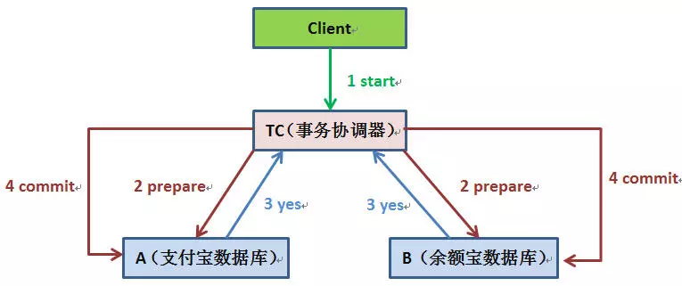
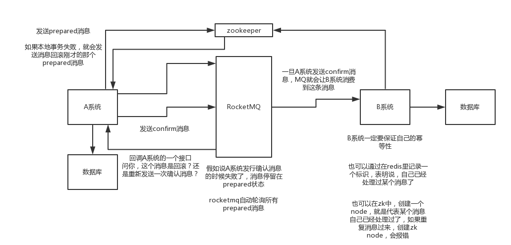

## 场景介绍

- 支付宝转账余额宝，支付宝扣除转账的钱以后，系统挂了，余额宝账户并没有增加相应的金额，数据就会出现不一致状况。
- 电商系统，用户下单后，订单表插入一条记录，库存表商品数量必须减一，如何保证。
- 搜索广告系统，用户点击某个广告，除了在点击事件中增加一条记录，商家账户表中找到商家并扣除广告费，如何保证。

## 单机事务解决方案

- 事务回滚

  ```
  Begin transaction
   update A set amount=amount-10000 where userId=1;
   update B set amount=amount+10000 where userId=1;
  End transaction
  commit;
  
  使用Spring:
  
  @Transactional(rollbackFor=Exception.class)
  public void transfer(){
      updateATable();
      updateBTable();
  }
  ```

## 分布式事务解决方案

- 两阶段提交协议(Two-phase Commit,2PC)—实际开发中不采用

  - 定义

    

    ```
    流程：
    1.client发起一个请求到事务协调器TC。
    2.TC先将prepare消息写到本地，向所有参与者发prepare消息。
    给A发的是扣款的消息
    给B发的是增钱的消息
    本地日志类似凭证的效果
    3.参与者收到prepare消息，执行具体本机事务，不执行commit，成功返回yes，失败返回no，返回前都要把消息写入本地日志。
    4.TC收集所有参与者返回的消息，如果执行器都返回yes，那么给所有执行器发送commit消息，执行器收到commit后执行本地事务的commit，如果有任何一个返回no，TC给所有的执行器发送abort消息，执行器收到abort消息后执行事务abort操作。
    ```

  - 缺点

    ```
    1.两阶段提交涉及多次节点间的网络通信，通信时间太长
    2.事务时间相对变长了，锁定的资源的时间也变长了，造成资源等待时间也增加。
    ```

- TCC方案—实际开发中不采用

  - Try ：对各个服务的资源做检测，对资源进行锁定或者预留
  - Confirm：在各个服务中执行实际的操作
  - Cancel：如果任何一个服务的业务执行失败，就回滚
  - 缺点：严重依赖自己写回滚和补偿，造成补偿代码异常巨大

- 本地消息表方案—实际开发中不采用

  - 过程

    ```
    1.A在本地事务操作的同时，插入一条数据到消息表
    2.接着A把这个消息发送到MQ
    3.B收到这个消息后，在一个事务里，往自己本地消息表插入一条数据(幂等)，同时执行业务。
    4.B执行成功，会更新表状态和A的表状态
    5.如果B业务执行失败，不会更新消息表状态，A系统会定期扫描自己的消息表，如果有未处理的会再次发送到MQ，让B去处理。
    ```

  - 缺点：

    ```
    严重依赖数据库的消息表来管理实务，会导致高并发无力，难扩展
    ```

- 可靠消息最终一致性方案---一般采用这种方案

  

  ```
  举例子：从支付宝转1000到余额宝
  1.支付宝在扣钱事务提交之前，向mq发送prepare消息。
  
  2.当支付宝扣款事务被提交成功后，向mq发送确认消息，mq真正发出消息给消费者。
  
  3.当支付宝扣款事务提交失败回滚后，向mq发送取消，mq不会再发送改消息。
  
  4.对于未确认的消息，broker会定期回查支付宝系统。举个例子，支付宝扣钱事务提交成功，向mq发确认消息失败。
  ```

  - 优点

    ```
    1.消息独立存储，业务和消息系统解耦
    2.把过程式的两个过程，异步，提高了并发
    3.保证了事务最终一定有一个结果，也就是最终一致性
    ```

  - 缺点

    ```
    业务系统需要实现消息状态回查接口
    消费端要幂等
    ```

