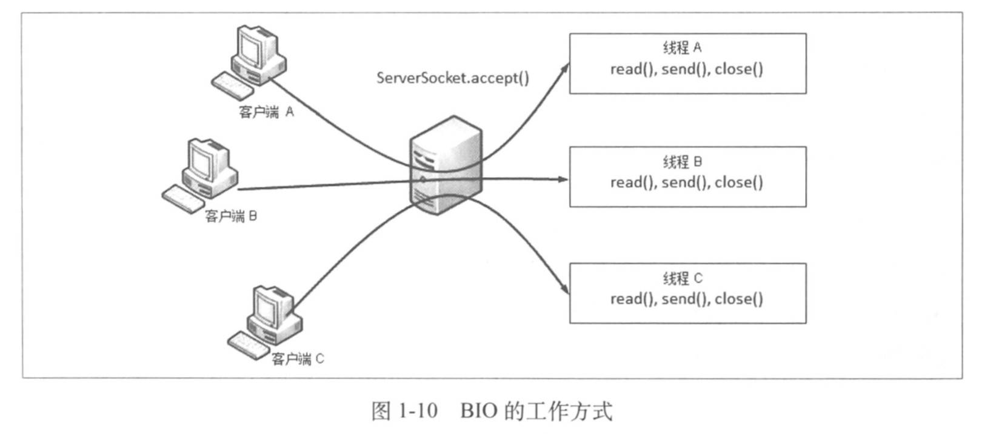
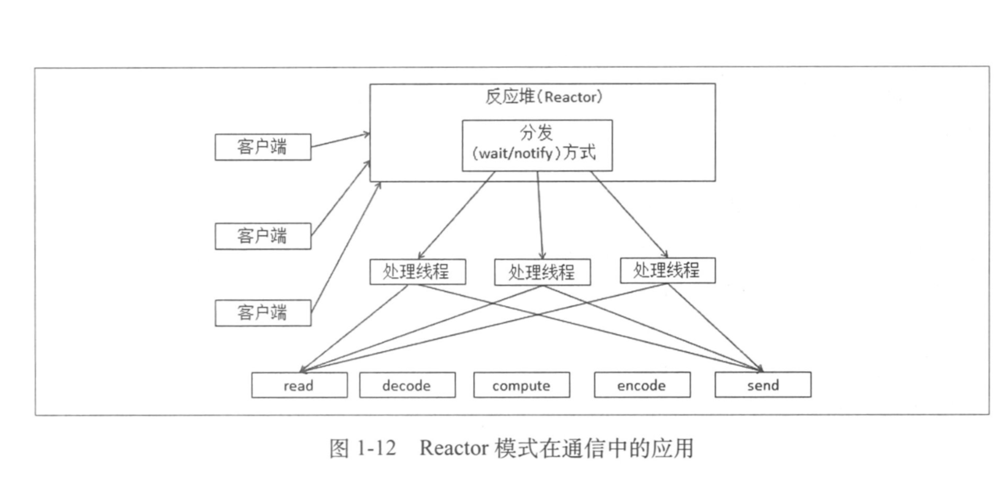
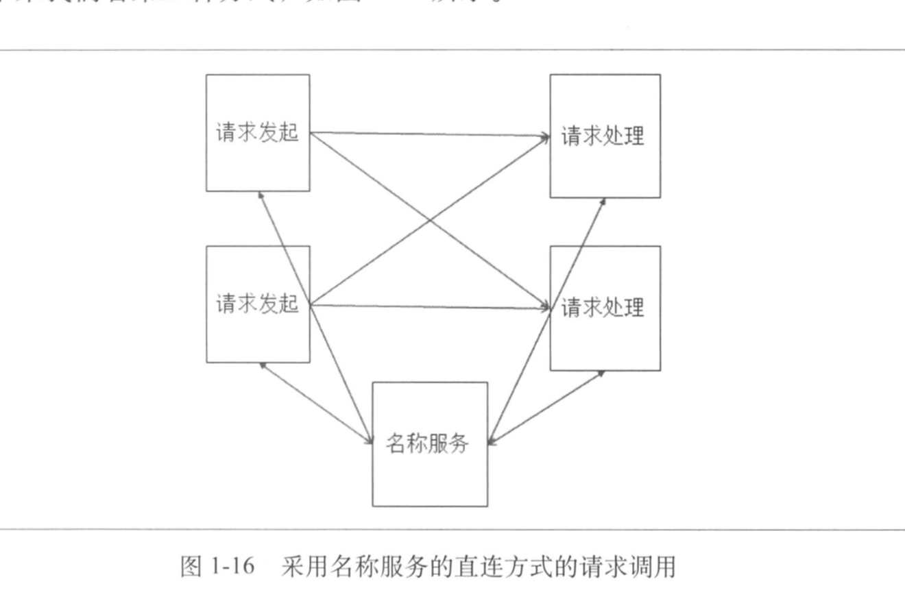
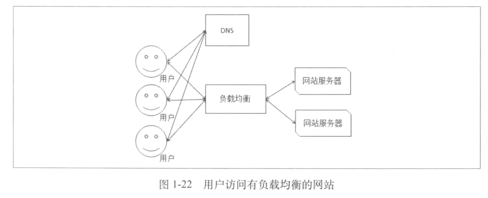

# 分布式系统介绍

## 定义

```
组件分布在网络计算机上，组件之间协调通信。
```

## 冯诺依曼型计算机

```
输入设备
输出设备
运算器
控制器
存储器：内存 外存
```

## 多核时代下多线程开发

```
利用多线程
根据CPU核心数设定线程数
线程之间的通信、协作、如何避免死锁
```

## 多进程

```
进程之间的内存空间是独立的
进程资源控制更容易实现，某个进程出现问题，不会造成整体不可用

一个进程内的多个线程共享进程的内存空间
```

## 网络通信

### OSI七层网络模型和TCP/IP模型

```
应用层
表现层
会话层
传输层
网络层
数据链路层
物理层

应用层
传输层
网间层
网络接口
```

### 网络IO实现方式

**BIO**



**NIO**

基于事件驱动，采用Reactor模式



**AIO**

异步IO

## 注册中心/名称服务



```
由请求发起方自己进行负载均衡调用服务

类似Dubbo
```

## 负载均衡



## 分布式系统的难点

### 单点故障如何处理

```
单点-集群：
即使某个节点挂了，也不会导致服务完全不可用，比如数据库，只是部分数据无法操作
```

### 分布式事务如何实现

# 大型网站及架构演进过程

## 什么才算大型网站

```
访问量很大&数据量很大
```

## 演进过程

### 单机构建

### 单机负载告警，应用与数据库分离

### 应用服务器负载告警，应用服务器走向集群

- 负载均衡：需要引入负载均衡
- 会话数据session：集中到一个节点存储session（现在已经不使用session管理会话，通过sso单点登录替代）

### 数据库读压力变大，读写分离

- 数据复制问题

### 引入搜索引擎

### 引入缓存

