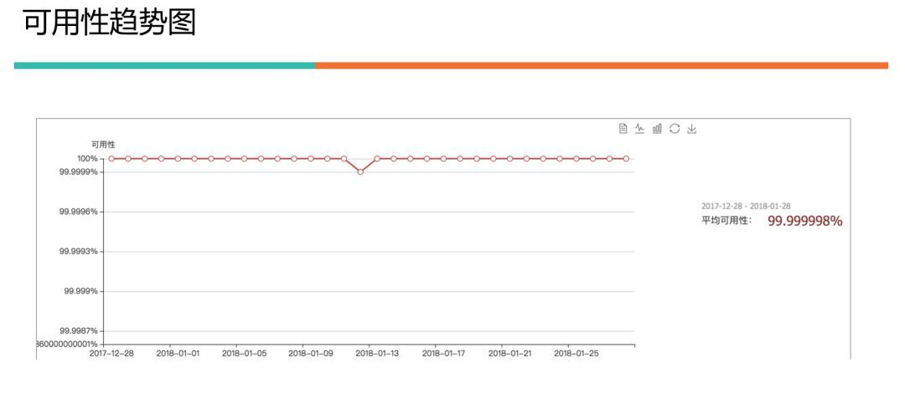
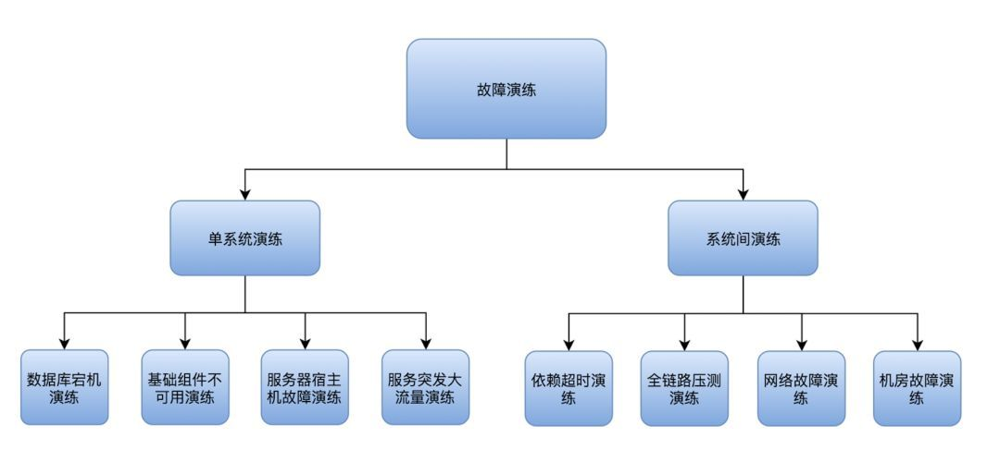
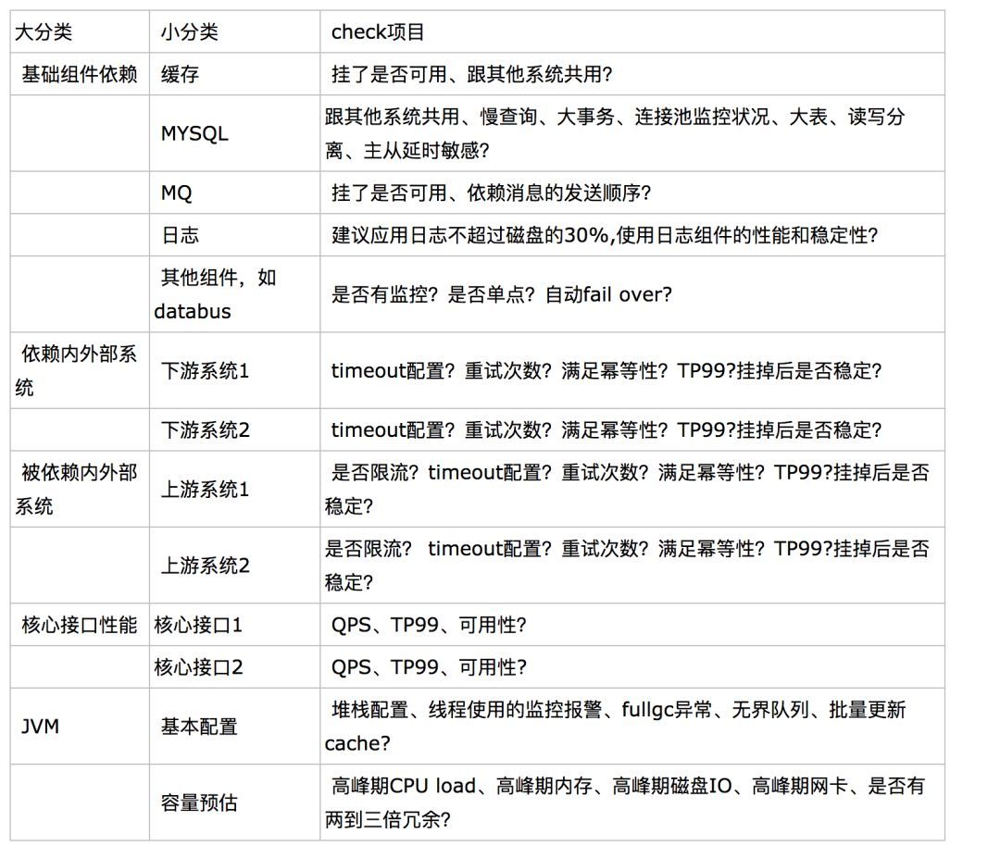

## 可用性趋势图



## 调用外部系统超时时间和重试次数要合理

```
超时过长、重试过多，连接池被打满，系统死掉，继而造成雪崩

超时过短、重试太少，请求返回结果不准确

如何做？
统计这个接口99%的超时时间是多少，设置的超时时间在这个基础上加50%。
重试次数如果系统服务重要性高，则按照默认，一般是重试三次。否则，可以不重试。
```

## 对我们依赖的下游要有熔断

```
在依赖的服务不可用时，服务调用方应该通过一些技术手段，向上提供有损服务，保证业务柔性可用。

如何做？
自动熔断：可以使用Netflix的Hystrix
手动熔断：确认下游支付通道抖动或不可用，可以手动关闭通道。
```

## 对依赖我们的上游要有限流

```
做好保障，不被上游的疏忽影响，避免导致系统宕机

如何做？
通过对服务端的业务性能压测，可以分析出一个相对合理的最大QPS。
可以使用Netflix的Hystrix
```

## 慢查询监控和优化

```
慢查询会降低应用的响应性能和并发性能。在业务量增加的情况下造成数据库所在的服务器CPU利用率急剧攀升，严重的会导致数据库不响应，只能重启解决.

如何做？
对慢查询对应监控报警。
索引优化。索引过多会影响数据库写性能。索引不够查询会慢。
读写分离。写走主库，读走从库。
将查询分成实时查询、近实时查询和离线查询。实时查询可穿透数据库，其它的不走数据库，可以用Elasticsearch来实现一个查询中心，处理近实时查询和离线查询。
```

## 代码层面-废弃逻辑及时清理

```
如何做？
code review保证每段逻辑都明白其含义，弄清楚是否是历史逻辑或者临时逻辑。
```

## 核心路径进行资源隔离

```
如何做？
服务器物理隔离
线程池资源隔离:Hystrix通过命令模式，将每个类型的业务请求封装成对应的命令请求。每个命令请求对应一个线程池，创建好的线程池是被放入到ConcurrentHashMap中。
信号量资源隔离:开发者可以使用Hystrix限制系统对某一个依赖的最高并发数，这个基本上就是一个限流策略。每次调用依赖时都会检查一下是否到达信号量的限制值，如达到，则拒绝。
```

## 最后，一定要演练，防止更差的可用性



## 定期检查是否达到标准



## 参考资料

### [战狼：业务高速增长下，如何保证系统的稳定性和高可用](https://cloud.tencent.com/developer/article/1155057)