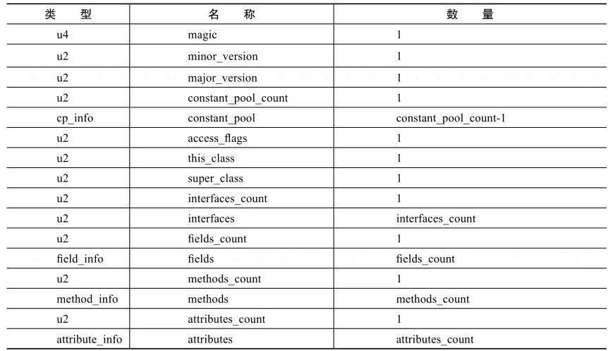
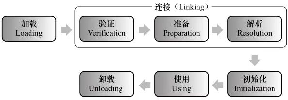
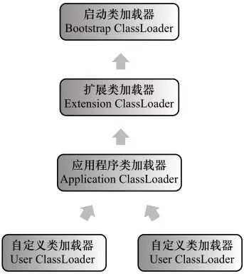
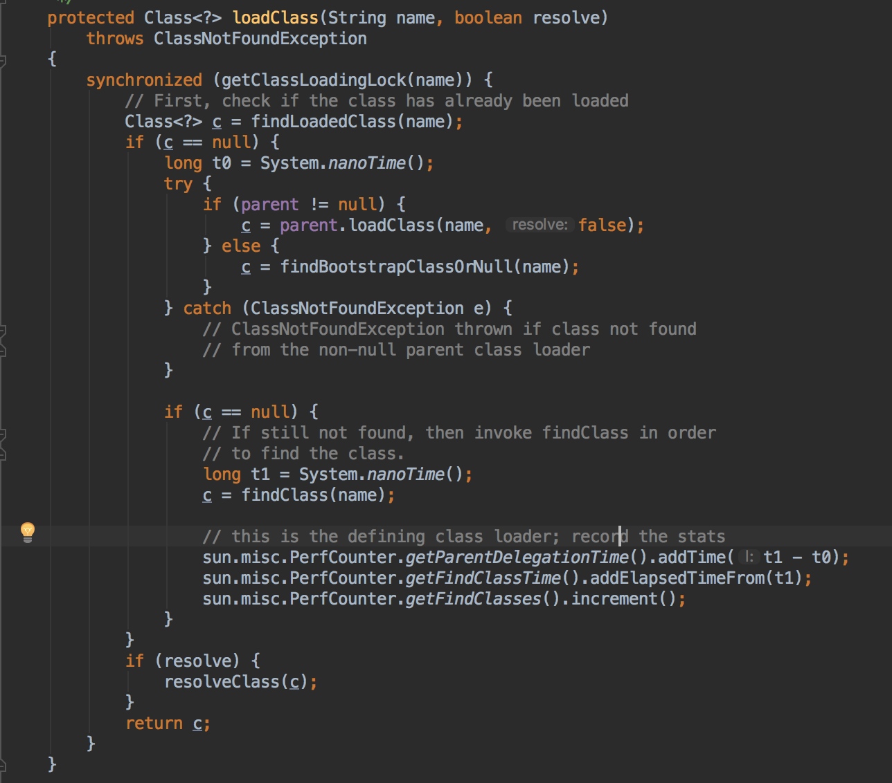
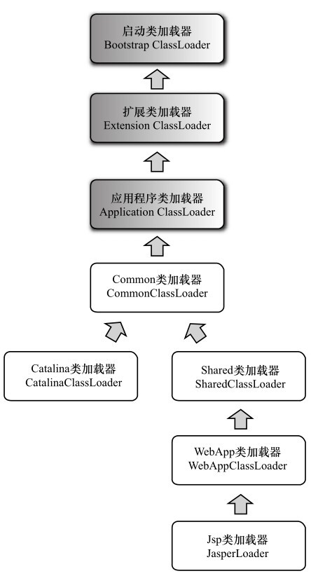
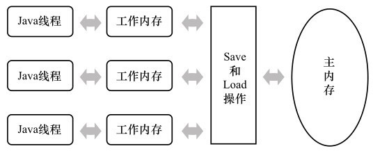

## 本书基于JDK1.7

## Java获得认可的原因

- 语言结构严谨，面向对象
- 一次编写，到处运行
- 提供了相对安全的内存管理和访问机制，避免了绝大部分的内存泄露和指针越界
- 实现了热点代码检测和运行时编译与优化
- 拥有完善的应用程序接口，有无数的第三方类库

## JDK

Java程序设计语言+Java虚拟机+Java API类库

## JRE(Java Runtime Environment)

Java AP类库子集Java SE API+Java虚拟机

## HotSpot VM

JDK和OpenJDK所带的虚拟机

## Dalvik VM

Android平台的虚拟机

## Java是解释执行的么？

```
解释执行：将编译好的字节码一行一行地翻译为机器码执行。

编译执行：以方法为单位，将字节码一次性翻译为机器码后执行。
```

```
HotSpot虚拟机中，提供了两种编译模式，解释执行和即时编译(JIT:Just in time)。
解释执行即逐条翻译字节码为可运行的机器码，优势是不用等待。
即时编译以方法为单位，将字节码一次性翻译为机器码，实际运行效率更高。
如何选择呢？二八定律，大部分不常用的代码，不需要消耗时间去编译为机器码，解释执行，小部分热点代码，就即时编译为机器码(热点代码，编译一次，反复运行)高效执行，提供运行效率。
```

## 自己动手编译Open JDK

- 源代码下载地址

  ```
  http://download.java.net/openjdk/jdk7/promoted/b147/openjdk-7-fcs-src-b147-27_jun_2011.zip
  ```

- 配置编译参数

- make开始编译

## 运行时数据区


### 程序计数器

```
1.线程私有

2.代表的是当前线程所执行的字节码的行号指示器，字节码解释器工作就是通过改变计数器的值来选取下一条需要执行的字节码指令

3.如果当前线程执行的是java方法，计时器的值为正在执行的字节码指令地址
  如果当前线程执行的是Native方法，计时器的值为空
  
4.唯一一个不会发生OutOfMemoryError的区域  
```

### Java虚拟机栈

```
1.线程私有，生命周期与线程相同

2.代表的是Java方法执行的内存模型：
每个方法在执行的同时都会创建一个栈帧，用于存储局部变量表、操作数栈、动态链接、方法出口等信息
每个方法从调用直到执行完成，对应着一个栈帧在虚拟机栈中入栈到出栈

3.局部变量表，存放的内容：编译器可知的各种基本数据类型、对象引用、returnAddress类型，它的大小在编译完成后就是固定的

4.可能抛出的异常有StackOverflowError & OutOfMemoryError
```

### 本地方法栈

```
1.线程私有

2.类似Java虚拟机栈，区别是为Native方法服务，而Java虚拟机栈是为Java方法服务

3.可能抛出的异常有StackOverflowError & OutOfMemoryError
```

### Java堆

```
1.线程共享

2.目的：存放对象实例和数组

3.如何回收内存：被垃圾收集器采用分代收集算法回收

4.可扩展，通过-Xmx -Xms控制

5.可能抛出的异常有OutOfMemoryError
```

### 方法区

```
1.线程共享

2.目的：存储已经被虚拟机加载的类信息、常量、静态变量、即时编译器编译后的代码等数据

3.如何回收内存：目前是永久代实现

4.可能抛出的异常有OutOfMemoryError，内存申请不到的时候就会抛出这个异常
```

包含：

- 运行时常量池

  ```
  1.内容：存放的是class文件编译后生成的各种字面量和符号引用
  
  2.动态性：运行期间也可以将新的常量放入池中，
  比如String.intern()，s.intern()的意思是如果字符串常量池中已经包含一个等于此String对象的字符串，就返回常量池中代表这个字符串的String对象，否则，将此String对象包含的字符串添加到常量池中，并返回此String对象的引用，应用这个特性可以节省很大内存。
  
  3.版本差异：
  jdk6和之前是在永久代
  
  jdk7是java heap
  ```

## 直接内存

- Direct Memory

  ```
  1.不是虚拟机运行时数据区，也不是JVM规范中的内存，是本机直接内存
  
  2.应用：native函数直接分配堆外内存，再通过堆中的一个DirectByteBuffer对象持有直接内存的引用，用于显著提高性能
  
  3.可能抛出的异常有OutOfMemoryError
  ```

## JVM对象的创建、布局、如何访问的

### 对象的创建过程

```
虚拟机遇到一条new指令，执行的流程如下
1.类加载检查，没有加载就先类加载

2.为对象分配内存，分配的大小在类加载的过程就已知

3.虚拟机将分配到的内存空间都初始化为零值

4.虚拟机对对象进行必要的设置，比如对象属于哪个类，对象的哈希码，分代年龄等信息

5.执行init方法

6.对象创建完成
```

内存分配方式

```
两种方式：
一、指针碰撞：堆中内存是绝对规整的，用过的内存放在一边，空闲的在另一边，通过一个指针移动所需分配的内存大小
二、空闲列表：堆中内存不是绝对规整的，维护一个列表，从列表中找内存分配
根据垃圾收集器是有否压缩整功能来选择，CMS基于标记清除算法的收集器，就采用的是空闲列表方式分配内存
```

### 对象的内存布局

```
组成：
1.对象头：
第一部分：存储对象自身运行时数据，哈希码，锁状态标志，GC分代年龄、线程持有的锁，大小为32bit/64
第二部分：类型指针，确定对象是哪个类的实例
第三部分：数组大小，可选

2.实例数据：
各种类型字段的内容，包含父类继承下来的

3.对齐填充：
占位符，填充保证对象是8的整数倍字节

```

### 对象的访问定位

```
通过栈中的reference来访问堆中的具体对象的方式：
1.句柄
reference存储对象的句柄地址，通过对象句柄再访问对象
ref->对象句柄->对象
优点：对象回收移动，但是ref中存储的对象句柄是固定的


2.直接指针（HotSpot使用的这种方式）
reference存储的是对象的地址
ref->对象
优点：速度更快
```


## 虚拟机参数

```
指定堆的最小值
-Xms20m 

指定堆的最大值
-Xmx20m

指定当虚拟机出现内存溢出dump出当前的内存堆快快照
-XX:+HeapDumpOnOutOfMemoryError 

指定Java虚拟机栈的大小
-Xss128k

指定方法区的大小
-XX:MaxPermSize

打印GC日志，输出内存分配情况
-XX:+PrintGVDetails

指定Eden区和其中一个Survivor区的大小比例
-XX:SurvivorRatio=8

```

## 虚拟机异常场景和解决

- 内存溢出

  ```
  1.根据dump出的快照，分析是否有内存泄露
  2.对比物理机器大小调整堆大小
  ```

- 建立过多的线程导致的栈内存溢出如何解决

  ```
  1.减少堆内存和栈容量，换取更多的线程
  
  操作系统内存-堆内存-方法区内存 约等于 虚拟机栈内存
  ```

- 过多的动态创建类导致方法区内存溢出

  ```
  1.场景：CGLib字节码增强过多的创建了类
  
  
  ```

## 垃圾收集器

### GC需要完成的三件事

- 哪些内存需要回收
- 什么时候回收
- 如何回收

### 程序计数器、虚拟机栈、本地方法栈的内存回收

- 方法结束或者线程结束的时候，内存就跟着回收了，不需要过多的考虑

### 方法区的内存回收

```
可以回收的主要东西：(并不一定会回收)
废弃常量：没有对象引用该常量
无用的类：1.该类的所有实例都已经被回收 2.加载该类的ClassLoader已经被回收 3.该类对应的Claa对象没有在任何地方被引用

```

### 如何判断对象死了没有

- 引用计数算法--JVM并没有使用该方法

  ```
  给对象中添加一个引用计数器，每当有一个地方引用它的时候，计数器值就加1；当引用失效时候，计数器的值减1；任何时刻计数器为0的对象就是不可能再被使用的。
  
  使用该算法的技术：
  AS3、Python等
  ```

- 可达性分析算法--JVM判断对象是否存活的算法

  

  ```
  基本思路：
  通过一系列的称为GC Roots的对象作为起点，从这些节点开始向下搜索，搜索引用链，当一个对象到GC Roots没有任何引用链的时候，该对象被第一次标记并且进行一次删选，如果该对象有必要执行finalize()，把改对象放入F-Queue队列，开启线程去异步执行队列中对象的finalize()方法；之后GC会对F-Queue中的对象进行第二次标记。如果两次标记后对象仍旧到GC Roots不可达，就认为对象已死。
  
  对象自救：
  只有一次机会，也就是在finalize()方法中，错过就没机会了,finalize()方法只会被系统自动调用一次，可以在这里自救一次。
  
  使用自救的限制：建议不用，代价高，导致不确定性.
  
  JVM中，可作为GC Roots的对象有下面几种：
  虚拟机栈中引用的对象
  方法区中类静态属性引用的对象
  方法区中常量引用的对象
  本地方法栈中JNI引用的对象
  ```

### 引用

- 强引用

  ```
  Object obj = new Object()；
  
  只要obj还存在，垃圾收集器永远不会回收这类引用
  ```

- 软引用

  ```
  描述：还有用但非必需的对象
  
  回收：在系统要发生内存溢出之前，会把这些对象列入回收范围等待下一次GC
  
  实现：SoftReference
  ```

- 弱引用

  ```
  描述：非必须对象，强度更弱
  
  回收：垃圾收集器一工作，就会回收被弱引用关联的对象
  
  实现：WeakReference
  ```

- 虚引用

  ```
  目的：在这个对象被回收的时候可以收到一个系统通知
  ```

### 垃圾收集算法有哪些

- 标记-清除算法(Mark-Sweep)

  ```
  基本思路：
  可达性分析算法判断对象是否到GC Roots可达，不可达就标记一次，放入F-Queue队列，之后对Queue进行第二次分析，再标记一次，标记两次后就清除。
  
  和可达性分析算法的关系：
  可达性分析算法是标记清除算法的基础。
  
  何处使用：
  
  缺点：
  1.效率不高，标记和清除都不高
  2.空间上会产生大量不连续的内存碎片
  
  特性：
  是其他回收算法的基础
  
  ```

- 复制算法

  ```
  基本思路：
  内存划分包含一块较大的Eden空间和两块较小的Survivor空间，先使用Eden和其中一块Survivor，回收的时候，将Eden和其中一块的Survior中还存活的对象复制到另一快Survivor，清理掉Eden和用过的Survivor。to Survivor不够用的时候，由老年代来担保，老年代来分配内存。
  
  其中，Eden和Survivor的大小比是8：1
  
  何处使用：
  新生代
  
  优点：不用考虑内存碎片问题，只需付出少量存活对象的复制成本就可以完成收集
  
  ```

- 标记整理算法

  ```
  基本思路：
  采用可达性分析标记对象，把活着的对象移动到一端，清理掉边界以外的内存。
  
  何处使用：
  老年代
  
  优点：不用考虑复制和内存空着的问题
  ```

### HotSpot的如何去发起内存回收的

- 跟枚举根节点 安全点 安全区域 有关，只有到达安全点才可以暂停进行GC。

### HotSpot的分代收集器


- 不同的分区采用不同的垃圾收集器，并没有绝对完美万能的垃圾收集器

- Serial收集器（单线程新生代）

  ```
  何处使用：
  client模式下虚拟机新生代的默认收集器
  
  基本原理：
  单线程，暂停其他的工作线程。
  
  缺点：会暂停工作线程，但是在不断优化，但还是不能完全消除暂停
  
  采用的垃圾收集算法：
  复制算法-新生代
  ```

- ParNew收集器（多线程新生代）

  ```
  何处使用：
  Server模式下虚拟机新生代的默认收集器
  
  基本原理：
  多线程，交替收集，暂停其他的工作线程
  
  特性：在JDK1.5开始，可以配合CMS收集器一起工作
  
  采用的垃圾收集算法：
  复制算法-新生代
  ```

- Parallel Scavenge收集器（多线程新年代）

  ```
  何处使用：
  新生代
  
  特性：多线程，自适应调节，提高了吞吐量
  
  采用的垃圾收集算法：
  复制算法-新生代
  ```

- Serial Old收集器（单线程老年代）

  ```
  何处使用：
  client模式下虚拟机老年代
  
  基本原理：
  单线程
  
  采用的垃圾收集算法：
  标记-整理算法-老年代
  ```

- Parallel Old收集器（多线程老年代）

  ```
  何处使用：
  client模式下虚拟机老年代
  
  基本原理：
  多线程,1.6开始引入,吞吐量搞，暂停工作线程的时间短
  
  采用的垃圾收集算法：
  标记-整理算法-老年代
  ```

- CMS收集器

  ```
  Concurrent Mark Sweep收集器：
  
  过程：
  1.初始标记
  2.并发标记
  3.重新标记
  4.并发清除
  
  特性：停顿时间更加减少
  
  采用的垃圾收集算法：
  标记-清除算法，会产生大量的内存碎片
  ```

- G1收集器 jdk1.7正式发布

  ```
  特性：
  1.并发，不停顿
  2.分代收集，新生对象和老年对象用不同的方式处理
  3.空间整合：整体上标记-整理，局部上复制
  4.可预测的停顿时间：明确指定在M毫秒内，停顿时间不超过N
  整个堆划分为大小相等的独立区域，维护一个优先列表，优先回收价值大的区域。
  ```

### GC日志分析

```
Full GC：停顿收集
3324K->152K：GC前Java堆已使用容量->GC后Java堆已使用容量
```

## 内存分配规则

```
对象主要分配在新生代的Eden区，启动了本地线程缓冲，按线程优先在TLAB上分配，少数情况下直接分配在老年代。

取决于采用了哪种垃圾收集器组合，还有虚拟机中内存相关的参数。
```

- 优先在Eden分配

  ```
  对象优先在Eden区分配，当Eden区没有足够的空间进行分配时，虚拟机发起Minor GC。
  ```

- 当Eden区间内存不够，移动Eden存活的对象到Survivor空间，Survivor空间不够的话就利用分配担保机制，将存活的对象移动到老年代，于此同时会进行一次对新生代的Minor GC

- 大对象直接进入老年代

  ```
  1.需要大量连续内存空间的Java对象，大小超过虚拟机设置的大对象参数，当分配的时候会直接进入老年代
  
  2.-XX:PretenureSizeThreshold，该参数用于指定超过这个大小的对象会直接进入老年代
  
  3.如何避免老年代存储太多导致内存变少？
  避免大数组，这种数组会直接分配到老年代。
  ```

- 长期存活的对象将进入老年代

  ```
  1.每个对象都有一个对象年龄计数器
  
  2.每经过一次Minor GC，年龄加1
  
  3.当年龄等于阈值就会被移动到老年代，大对象会直接进入老年代
  
  4.阈值指定参数
  -XX:MaxTenuringThreshold=15(默认值是15)
  ```

- Survivor空间中相同年龄的对象大小总和大于改空间的一半，这些对象也会进入老年代

## GC分类

- 新生代GC

  ```
  Minor GC
  ```

- 老年代GC

  ```
  Major GC
  ```
  
- Full GC

  ```
  对整个堆
  ```

## JDK命令行工具

```
jdk工具1.6之后默认是开启的

jps
列出正在运行的虚拟机进程

jstat
监视虚拟机各种运行状态信息

jmap
生成堆转存快照

jstack
生成虚拟机当前时刻线程快照
```

## JDK可视化工具---（比命令行可视化强大很多）

- JConsole：可视化监控、管理虚拟机的工具

  ```
  1.启动
  启动 /bin下的jconsole
  
  2.选择一个进程来开始监控
  
  3.demo来观看
  public class OOMObject {
      private byte[] holder = new byte[64 * 1024];
  
  
      public static void main(String[] args) {
          List<OOMObject> list = new ArrayList<>();
          for (int i = 0; i < 1000; i++) {
              try {
                  Thread.sleep(50);
              } catch (InterruptedException e) {
                  e.printStackTrace();
              }
              list.add(new OOMObject());
          }
          System.gc();
      }
  }
  
  4.可视化包含模块
  
  ```

- 

- VisualVM ：运行监视和故障处理程序、性能分析

  ```
  1.启动
  启动/bin下的jvisualvm
  
  2.选择一个进程来监控
  
  3.很好用的插件：BTrace
  作用：动态加入原本不存在的代码，可以用于生产环境中的各种调试
  ```

  

## 调(溢)优(出)案例

- 在线文档应用

  ```
  特性：文档序列化读入内存，大对象，会直接进入老年代，Full GC停顿时间长。
  
  如何优化：一台服务器部署5个应用，前端ngnix负载,采用CMS垃圾收集器。
  ```

- 考试服务器向每个考场推送考题应用

  ```
  参数：32位操作系统，2G内存，分配给堆1.6GB，剩下最多0.4给堆外内存
  
  通过分析堆内存，发现各个分区都很稳定，但是考试服务器向考场推送的时候还是会发生内存溢出，jstat实时紧盯屏幕的时候，找到了异常栈，OutOfMomoryError:DirectNIOBuffer，判断是堆外内存不够。
  
  堆外内存如何回收的：
  在发生Full GC的时候，收集器会顺便回收堆外。
  ```

- 虚拟机无处处理过多的请求导致JVM崩溃

  ```
  场景：app->服务器->外部系统
  
  外部系统处理请求耗时很久，一直无法返回，app请求一直进来，导致服务器无法处理，所以虚拟机崩溃。
  ```

- Idea的调优

  ```
  场景：如何缩短idea本地启动应用的时间
  ```

## 字节码和虚拟机的关系

- java编译：源代码->字节码(Class文件)(和运行的平台无关)
- 一次编写，到处运行的基石：字节码+不同平台的虚拟机，虚拟机不与语言绑定，是与字节码绑定的
- 多种语言都可以编译为Class文件，也就是字节码

## Class文件

- 结构：以8位字节为基础单位的二进制流

- 包含的数据类型

  ```
  无符号数：用来表示数字、索引引用、数量值、字符串值；以u1,u2,u4,u8代表1个字节，2个字节，4个字节，8个字节
  表：由多个无符号数和表构成的复合数据类型
  ```

- Class文件格式

  

  ```
  类
  public class ReferenceCountGC {
      public Object instance = null;
  
      private static final int _1MB = 1024 * 1024;
  
      private byte[] bigsize = new byte[2 * _1MB];
  
      public static void main(String[] args) {
          ReferenceCountGC objA = new ReferenceCountGC();
          ReferenceCountGC objB = new ReferenceCountGC();
  
          objA.instance = objB;
          objB.instance = objA;
  
          objA = null;
          objB = null;
  
          System.gc();
      }
  }
  
  class文件
  cafe babe 0000 0034 0022 0a00 0800 1909
  0003 001a 0700 1b03 0020 0000 0900 0300
  1c0a 0003 0019 0a00 1d00 1e07 001f 0100
  0869 6e73 7461 6e63 6501 0012 4c6a 6176
  612f 6c61 6e67 2f4f 626a 6563 743b 0100
  045f 314d 4201 0001 4901 000d 436f 6e73
  7461 6e74 5661 6c75 6503 0010 0000 0100
  0762 6967 7369 7a65 0100 025b 4201 0006
  3c69 6e69 743e 0100 0328 2956 0100 0443
  6f64 6501 000f 4c69 6e65 4e75 6d62 6572
  5461 626c 6501 0004 6d61 696e 0100 1628
  5b4c 6a61 7661 2f6c 616e 672f 5374 7269
  6e67 3b29 5601 000a 536f 7572 6365 4669
  6c65 0100 1552 6566 6572 656e 6365 436f
  756e 7447 432e 6a61 7661 0c00 1100 120c
  0009 000a 0100 2877 7777 2f62 6c75 652f
  636f 6d2f 6a61 7661 2f6a 766d 5f33 2f52
  6566 6572 656e 6365 436f 756e 7447 430c
  000f 0010 0700 200c 0021 0012 0100 106a
  6176 612f 6c61 6e67 2f4f 626a 6563 7401
  0010 6a61 7661 2f6c 616e 672f 5379 7374
  656d 0100 0267 6300 2100 0300 0800 0000
  0300 0100 0900 0a00 0000 1a00 0b00 0c00
  0100 0d00 0000 0200 0e00 0200 0f00 1000
  0000 0200 0100 1100 1200 0100 1300 0000
  3200 0200 0100 0000 122a b700 012a 01b5
  0002 2a12 04bc 08b5 0005 b100 0000 0100
  1400 0000 0e00 0300 0000 0600 0400 0700
  0900 0b00 0900 1500 1600 0100 1300 0000
  5600 0200 0300 0000 22bb 0003 59b7 0006
  4cbb 0003 59b7 0006 4d2b 2cb5 0002 2c2b
  b500 0201 4c01 4db8 0007 b100 0000 0100
  1400 0000 2200 0800 0000 0e00 0800 0f00
  1000 1100 1500 1200 1a00 1400 1c00 1500
  1e00 1700 2100 1800 0100 1700 0000 0200
  18
  ```

  ```
  1.magic 魔数
  作用：确定这个文件是否是可以被虚拟机接受的文件
  
  为何用魔数，而不是用文件扩展名来标识呢，因为文件扩展名可以被更改
  
  值：0xCAFEBABE（魔鬼宝贝）
  
  大小：4个字节
  ```

  ```
  2.minor_version class 文件的次版本号
  
  3.major_version class 文件的主版本号(编译它的虚拟机的版本号)
  
  兼容性：高版本的虚拟机可以向下兼容运行低版本的class文件，但是不能向上运行高版本的虚拟机编译出来的class文件
  ```

  ```
  4.constant_pool_count 常量池
  类型：表类型
  
  常量池容量计数：从1开始，而不是从0开始计数，空出0为了表示不引用任何一个常量池项目，有多少个常量=容量计数-1
  
  内容：
  字面量
  符号引用：类和接口的全限定名\字段的名称和描述符\方法的名称和描述符
  
  javac编译的时候不会进行连接，是在运行的时候动态链接，从而形成方法，字段的最终布局
  
  内容的类型：
  每一个常量都是一个表，一共有14种，每个常量的第一位都是标记，代表属于什么常量.
  
  ```

  ```
  5.access_flag 访问标志
  
  大小：2字节
  
  作用：识别类、接口的访问信息，是接口，还是类，是不是public，是不是abstract，是不是final等
  ```

  

  ```
  6.this_class 类索引 确定这个类的全限定类名
  大小 u2
  7.super_class 父类索引 确定这个类的父类的全限定名
  大小 u2
  8.interfaces 接口索引集合 确定这个类实现的接口集合
  大小 u2的集合
  
  用来确定这个类的继承关系
  ```

  ```
  9.字段表集合：用来描述接口/类中声明的变量
  field：包含类变量、实例变量

  包含的信息：
  字段的作用域 public private protected
  是不是类变量 static
  可变性 final 
  并发可见性 volatile
  是否被序列化 transient
  字段数据类型 基本类型/对象/数组
  字段名称 
  
  字段表的格式：
  u2 access_flags 
  u2 name_index 
  u2 descriptor_index
  u2 attributes_count
  attribute_info attributes 
  
  例子：
  故而可以根据二进制字段信息 推出 代码 private int m;
  ```
  
  ```
  10.方法表集合：原理和字段表集合相似
  
  包含的信息：
  访问标志
  名称索引
  描述符索引
  属性表集合
  
  Code--存放方法里的代码
  
  ```
  
  ```
  11.属性表集合：---字段表、方法表都会用到属性表集合
  vs 字段表集合---具体的描述类中的类字段和实例字段
  
  包含的属性表：
  Code属性表--存放java程序方法体中的代码编译后的字节码--存在于方法表的属性表集合中
  jvm中一个方法不允许超过65535条字节码指令
  
  异常属性表--存放方法中可能抛出的异常--存在于方法表的属性表集合中
  vs异常表--在Code属性里存放
  
  //...其他
  ```
  
- 为什么实例方法持有this引用？

  ```
  jvm在调用实例方法的时候，会自动传入this参数到实例方法
  
  局部变量表第一个参数是给this预留的，所以实例方法的参数值是从1开始算的
  ```

- Java异常和finally处理机制-异常表

  ```
  在Code属性表存放的字节码指令包含异常表
  
  异常表包含的内容：
  start_pc行
  end_pc行
  catch_type类型
  handler_pc行
  
  机制：当字节码在第start_pc行到end_pc行之间，出现了catch_type类型和子类的异常，转到handler_pc行处理
  
  catch_type==0，处理任何异常
  ```

## 字节码中的指令

### 加载和存储指令

- 将局部变量加载到操作栈 iload fload
- 将数值从操作数栈存储到局部变量表 istore
- 将常量加载到操作数栈 bipush

### 运算指令

- 加法指令 iadd fadd 
- 减法指令 isub
- 乘法指令 imul
- 除法指令 idiv
- 求余指令 irem
- 取反指令 ...

对于boolean、byte、char、short的会转换为int

### 类型转换指令

- int类型到long float转换
- ...

### 对象创建与访问指令

- 创建类实例的指令 new
- 创建数组的指令 newarray
- 访问类字段 /实例字段 getfield putfield getstatic putstatic
- 取数组长度 arraylength

### 操作数栈管理指令

### 控制转移指令

- 条件分支
- 复合条件分支
- 无条件分支

对于boolean、byte、char、short的会转换为int

### 方法调用和返回指令

- invokevirtual 用于实例方法调用
- invokeinterface 用于接口方法，搜索实现类方法并调用
- invokestatic 用于静态方法
- ireturn(boolean、byte、char、short、int)
- ...

### 异常处理指令

- 异常抛出：athrow
- 异常处理：没有指令，采用的异常表实现的

### 同步指令

- monitorrenter：同步开始调用该指令
- monitorexit：同步结束/异常调用该指令

## 类加载机制

### 类加载的原因

- 编译：各种类java语言代码->字节码
- 加载：类加载class文件

### 类加载机制

```
虚拟机把描述类的数据从class文件加载到内存，对数据进行校验、转换解析，初始化，最终形成可以被虚拟机直接使用的Java类型
```

### 类加载的生命周期

```
7个阶段：
加载loading
验证verification 
准备prepare
解析resolution
初始化init
使用using
卸载unloading
```



```
执行顺序？
按照加载->验证->准备->初始化->卸载的顺序开始，可以理解为异步，每个子步骤会调用其他步骤

解析可能在初始化之前，也可能在初始化之后，为了支持Java运行时绑定
```

### 初始化有且只有这5种情况会触发（适用于类，接口稍微有点区别，不需要等所有的父接口都初始化，当需要父接口的时候才初始化）

- 遇到new getstatic putstatic invokestatic这4个字节码指令，如果类没有初始化，要触发初始化
- 使用反射调用的时候，如果类没有进行初始化，要先触发初始化
- 当初始化一个类的时候，如果它的父类还没有初始化，要先初始化它的父类
- 虚拟机启动的时候，要先初始化main类
- MethodHandle实例解析结果有static句柄，需要先初始化类

```
反例：
在子类中引用父类的静态属性，在main方法打印调用SubClass.value(value在父类中定义的)，这个时候不会初始化子类

在main方法打印SubClass.CONSTANT_NAME(定义在子类)，不会初始化子类，类常量是定义在常量池中的
```

### 加载

```
加载阶段完成的3件事情：
1.通过一个类的全限定名来获取定义此类的二进制字节流
**这一步可扩展性很强，可以自定义类加载器，指定从不同的地方加载二进制流
比如：
从Zip中读取，为jar、war打了基础
从网络中读取，为Applet打基础
运行时计算生成，为动态代理打基础
Proxy中，用了ProxyGenerator.generateProxyClass为特定接口生成"*$Proxy"的代理类的二进制字节流

2.将这个字节流所代表的静态存储结构转化为方法区的运行时数据结构

3.在内存中生成一个代表这个类的Class对象，作为方法区这个类的各种数据的访问入口

特殊点：
数组类由虚拟机直接创建，但是数组的引用型元素依旧适用上面的逻辑
```

### 验证

```
验证字节流符合不符合Class文件格式的约束，不符合会抛出VerifyError异常
1.文件格式验证：
是否以魔数开头
主次版本是否在当前虚拟机处理范围之内
...
2.元数据验证--对字节码的语义验证，是否符合语言规范

3.字节码验证--对字节码的方法体验证

4.符号引用验证

原因：加载阶段的二进制字节流来源有多种渠道

可以优化的点：
如果代码被多次验证没问题，可以关闭验证阶段，缩短类加载的时间。
-Xverify:none
```

### 准备

```
准备阶段：为类变量分配内存并设置变量零值/常量值。--->类变量--->方法区

public static int count = 123;//123的赋值是在类构造器clinit方法中完成的

public static final int count = 123;//123的赋值是在准备阶段完成的
```

### 解析

```
解析阶段：虚拟机将常量池内的符号引用替换为直接引用

符号引用：
直接引用：直接指向目标的指针

特点：解析可以在初始化之前，也可以在初始化之后

缓存特性：解析完后可以缓存，避免重复解析
```

### 类初始化

```
初始化阶段：执行clinit类构造器，不是实例init构造器，按照Object->Parent->Child类构造器依次执行，如果一个类没有静态语句块和静态变量，那就缺省执行类构造器这一步

完成的动作：
类变量赋值
静态语句块执行

clinit vs init：类构造器 实例构造器

线程安全性：clinit是线程安全的
```

### 类加载器

- 应用

  ```
  OSGi
  热部署
  代码加密
  ```

- 类唯一性的确定

  ```
  类加载+类唯一确定
  ```

- 分类

  ```
  1.启动类加载器 
  BootstrapClassLoader
  C++语言实现
  负责加载lib目录下的类库
  开发者不可使用
  
  2.扩展类加载器
  ExtensionClassLoader
  sun.misc.Launcher&ExtClassLoader实现
  负责加载lib\ext目录下的类库
  开发者可使用
  
  3.应用程序类加载器
  ApplicationClassLoader
  sun.misc.Launcher$AppClassLoader实现
  负责加载classpath上指定的类库
  开发者可使用
  是默认的应用类加载
  
  ```

- 双亲委派模型

  

  ```
  双亲委派模型的工作过程：
  当一个类加载器收到加载请求的时候，首先不会自己去加载这个类，而是委托给父类加载器去完成，父类继续向它的父类委托，传送到启动类加载器，当启动类加载器无法加载，才反向传递给子类去加载。
  
  双亲：不是继承，而是组合的方式
  
  Object.class是由启动类加载器完成加载的
  
  实现代码：ClassLoader.loadClass()
  ```

  

## 虚拟机的执行引擎

### 执行引擎的表现结果

```
输入字节码>输出执行结果
```

### 栈帧-虚拟机支持方法调用和执行的数据结构


### 局部变量表

```
1.作用：用于存放方法参数和方法内部定义的局部变量，编译期间大小就存入了Code属性中

2.局部变量必须指定初始值，jvm不会给它赋零值
```

### 操作数栈

```
1.栈的深度在编译期存入Code属性中

2.举例子：
iadd在运行的时候，操作数栈中最接近栈顶的两个元素已经存入了两个int型的数值，当执行iadd指令的时候，会将两个int值出栈并相加，然后将结果入栈
```

### 动态连接

```
常量池中的符号引用转换为直接引用
```

### 方法返回地址

### 方法调用

### 重载，虚拟机是如何确定调用哪个方法的-可做笔试题

```
重载，通过静态分派，通过参数的静态类型作为判断方法版本的依据，而不是实际类型。

举例子：
abstract class Human{

}
Man extends Human{

}
Woman extends Human{

}
public void sayHello(Human guy){
sout("guy");
} 
public void sayHello(Man guy){
sout("man");
}
public void sayHello(Woman guy){
sout("woman");
}
psvm{
//静态类型       动态类型
Human man = new Man();
//静态类型       动态类型
Human woman = new Woman();
//test重载
s.sayHello(man);
s.sayHello(woman);
}
//输出
//guy
//guy
```

### 重写，虚拟机是如何确定调用哪个方法的，可做笔试题

```
重写，通过动态分派，在运行期根据实际类型确定方法执行版本的分派过程。

abstract class Human{
	protected abstract void sayHello();
}
class Man extends Human{
	@Override
	protected void sayHello(){
		sout("man hello");
	}
}
class WoMan extends Human{
	@Override
	protected void sayHello(){
		sout("woman hello");
	}
}
psvm{
//静态类型       动态类型
Human man = new Man();
//静态类型       动态类型
Human woman = new Woman();
man.sayHello();
woman.sayHello();
}
//输出
man hello
woman hello
```

### 动态类型指令--动态技术专题todo

```
invokedynamic

MethodHandle

作用类似，实现动态技术
```

### 如何执行字节码的

```
基于栈，指令入栈出栈执行的字节码
```

## Tomcat的类加载器

### 需要满足

- 部署在同一个服务器上的两个Web应用程序所使用的Java类库可以实现相互隔离，两个不同的应用程序可能依赖同一个第三方类库的不同版本
- 部署在同一个服务器上的两个web应用程序所使用的类库可以共享，避免重复的类库加载到内存，导致虚拟机方法区膨胀
- 支持JSP应用的web服务器，需要支持热部署，不用重启应用就可以生效修改后的应用

### Tomcat是如何规划用户类库结构和类加载器的




```
1.Common类加载器：
加载/common/*下的类库，可被tomcat和所有的web应用程序共同使用

2.Catalina类加载器
加载/server/*下的类库，只可以被tomcat使用，不可以被web应用程序使用

3.Shared类加载器
加载/shared/*下的类库，可被所有的web应用程序使用，对tomcat不可见

4.WebApp类加载器
加载/WebApp/WEB-INF/*下的类库，仅仅可以被当前web应用使用
每一个web应用对应一个类加载器实例

5.Jsp类加载器
加载jsp
每一个jsp文件对应一个类加载器实例

如何配置类加载器：
tomcat.conf/catalina.properties配置文件配置类加载
server.loader
share.loader
```

## OSGI是什么

- open service gateway initiative，基于java语言的动态模块化规范
- 作用：可以实现应用模块的热插播，只替换并重启部分模块，而不是重启整个应用
- 类加载器：网状结构，不再是双亲委派模式

## 字节码生成技术

- javac
- javassist
- CGLib
- ASM
- 动态代理

## 字节码生成技术的应用之动态代理

### 例子

```
public class DynamicProxyTest {
    interface IHello {
        void sayHello();
    }

    static class Hello implements IHello {

        @Override
        public void sayHello() {
            System.out.println("hello world");
        }
    }

    static class DynamicProxy implements InvocationHandler {
        Object originalObj;

        Object bind(Object originalObj){
            this.originalObj= originalObj;
            return Proxy.newProxyInstance(originalObj.getClass().getClassLoader(),originalObj.getClass().getInterfaces(),this);
        }
        @Override
        public Object invoke(Object proxy, Method method, Object[] args) throws Throwable {
            System.out.println("welcome");
            return method.invoke(originalObj,args);
        }
    }

    public static void main(String[] args) {
        IHello hello = (IHello) new DynamicProxy().bind(new Hello());
        hello.sayHello();
    }
}
```

### 动态代理的过程

```
基于接口的动态代理流程:
1.生成代理类实例:
IHello hello = Proxy.newProxyInstance(lassLoader loader,Class<?>[] interfaces,InvocationHandler h);
InvocationHandler的实现类里完成增强原始类的动作
源码流程：
验证->
缓存->
生成字节码class文件(可以反编译查看文件)->getProxyClass0(loader, intfs)->ProxyClassFactory.apply():ProxyGenerator.generateProxyClass(proxyName, interfaces, accessFlags)->
获取class文件对应参数为InvocationHandler的构造器->
构造器生成代理类实例

(正常开发流程，编译为字节码，jvm加载class，走流程加载，验证，解析，类初始化)

2.基于接口调用代理类实例的方法
hello.sayHello()；


```

## Java内存模型和线程

### 内存模型的目标

```
定义了虚拟机中将变量存储到内存中和从内存中取出变量的规则
```

### 内存模型



```
主内存：jvm虚拟机内存

8种操作：
lock 锁定主内存中的某个变量，为线程独占

unlock 解锁被线程占有的变量

read 读取，从主内存读取变量的值

load 载入，把从主内存读取的变量载入工作内存

use 使用，作用于工作内存

assign 赋值，作用于工作内存

store 存储，作用于工作内存

write 写入，把工作内存的值存入主内存

其中，
read load配套使用，必须一起出现
store write配套使用，必须一起出现
```

### volatile

- 作用

  ```
  被它修饰的变量对所有的线程是可见的，当一条线程修改了这个变量的值，新值对于其他变量来说是立即可知的。(不保证原子性)
  
  禁止指令重排序，可以保证代码的顺序和执行顺序一致，指令重排序，可能会优化代码的执行顺序。
  ```

- 使用场景

  ```
  1.开关等配置项可以使用volatile修饰，解决多线程并发问题，相较于使用synchronized性能更好
  ```

- 指令重排序--原理

  ```
  使用volatile修饰的变量赋值后，加了一个lock addl 操作，加了一个内存屏障，作用是不能使后面的指令重排序到内存屏障之前的位置。
  ```


### long和double的非原子性协定

- long和double的8个操作(read load use...)允许被划分为两次32位的操作来进行，但是一般商业虚拟机对long和double类型的变量采用了原子性的实现。

### 内存模型的特征

- 原子性

  ```
  1.基本类型的访问读写是具备原子性的
  ```

- 可见性

  ```
  1.volatile的特殊规则保证了新值能立即同步到主内存，以及每次使用前立即从主内存刷新
  
  2.synchronized保证可见性
  
  3.final也保证可见性
  ```

- 有序性

  ```
  volatile通过禁止指令重排序保证有序性
  
  synchronized通过锁保证有序性
  ```

### 