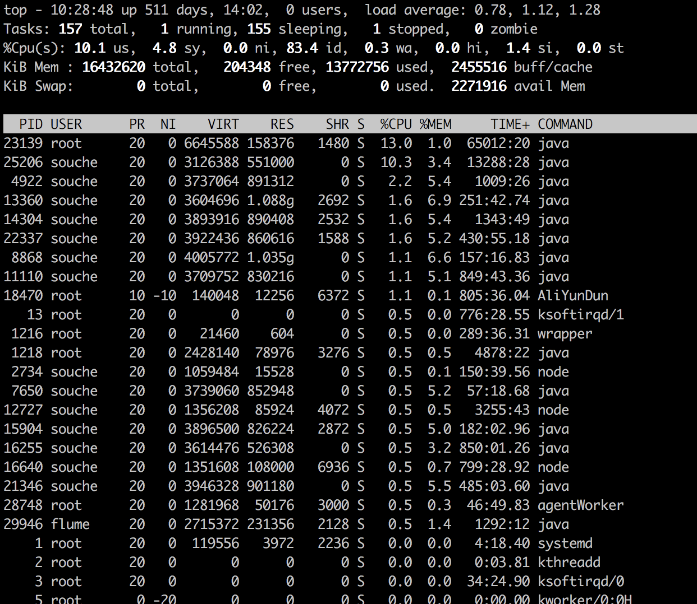

## top命令



```
作用：
查看cpu和load，默认每3s刷新一次，-d可以指定时间

各参数含义：(目测没有公司敏感信息)
10:32:04 up 511 days 当前系统时间，距离上次启动过去了511天

0 users  当前有0个用户在登录

load average: 1.00, 1.24, 1.31 最近1分钟、5分钟、15分钟系统的平均load

Tasks: 161 total,   2 running, 158 sleeping,   1 stopped,   0 zombie
当前总共有161个进程，2个进程在运行，158个进程在睡眠，1个进程处于停止状态，0个进程是僵尸状态，僵尸状态表示进程退出了

%Cpu(s): 11.1 us,  5.1 sy,  0.0 ni, 82.7 id,  0.2 wa,  0.0 hi,  0.9 si,  0.0 st
所有cpu的总体信息，输入1，可以切换到每个cpu的信息
11.1 us 用户空间占比cpu的百分比
5.1 sy	内核空间占比cpu的百分比
0.0 ni 	改变过优先级的进程占比cpu的百分比
82.7 id 空闲cpu的百分比
0.2 wa	磁盘IO等待占比cpu的百分比
0.0 hi	硬中断占比cpu的百分比
0.9 si	软中断占比cpu的百分比
0.0 st	虚拟cpu占比cpu的百分比

KiB Mem : 16432620 total,   197220 free, 13831628 used,  2403772 buff/cache
内存信息
16432620 total 	物理内存总量（字节）
197220 free	空闲内存总量
13831628 used	使用中的内存总量
2403772 buff/cache	缓存的内存总量

KiB Swap:        0 total,        0 free,        0 used.  2238220 avail Mem
swap分区内存信息
```

## cpu

### cpu采样计算

```
cpu的信息是采样计算的，选择2个时间点，计算这两个时间点之间的平均cpu信息
```

## load

### load的计算

```
所有核处于运行状态和不可中断状态的进程的平均数

单核：load=1表示系统一直处于负载

四核：load=1表示系统有75%的空闲

load数长时间高于cpu数，那么就认为负载高。
```

### load高的原因

```
1.一个是处于 runnable state 的进程不断增多,runnable state 增多一般是cpu资源不够
2.另一个是处于 uninterruptable state的进程不断增多,而uninterruptable state增多大部分时间是磁盘IO成为瓶颈。
```

### 请求数和工作线程/进程哪个决定load

```
工作线程/进程决定load
请求数很多，排队处理，load是由工作线程的处理性能决定的，不是请求数决定

举例：
线程池60个线程，请求1000个，每个线程10ms处理一个任务，处理完返回线程池，下一个任务处理，load很低

加入每个线程处理任务10s，load就=60，负载很高
```

## load高，cpu高排查

### cpu高不是问题，由于高cpu导致的高load才是问题

### 1.7的hashmap多线程死锁导致cpu高，从而导致load高

### 排查高cpu的思路

```
top -c 查看占用cpu高的进程

top -H -p pid 查看占用cpu高的线程

将10进制的线程pid转换为16进制的线程pid

jstack 进程pid | grep -A 20 '线程pid' 查看进程匹配的线程的堆栈信息，多打印几次，结合堆栈内容，分析(由于cpu采用计算的方式，不一定是堆栈的几行导致的高cpu)
```

### FullGC导致的高cpu排查思路

```
jstat -gcutil pid 1000 1000 每隔1s打印一次内存情况，打印1000次，观察老年代(O),永久代(MU)的内存使用率和FullGC次数

确认有频繁的FullGC发生，查看GC日志

jmap -dump:format=b,file=filename pid保留现场

重启应用，防止引起更大的线上问题

dump出的内容，结合MAT分析工具分析

FullGC导致cpu高的原因？
处理任务的情况下，fullGC，stop the world，cpu挂起，load升高

频繁的YoungGC也是会导致load升高的，也有stop the world
```

## load高，cpu低排查

```
cpu不高，load高，大概率是IO高，看wa参数。

对于依赖的dubbo、redis、http等监控耗时，查看日志

要做到熔断，防止下游超时，超时时间长，又一直不返回，导致load高
```

## load高的原因总结

```
1.死循环或者大量循环操作

2.频繁的YoungGC

3.频繁的FullGC

4.高磁盘IO

5.高网络IO
```

## 高load分析思路

```
1.top查看cpu信息，是否高cpu

2.如果高cpu，查看是否gc引起的高cpu

3.如果gc引起的，直接dump，非gc引起的多打印几次分析堆栈

4.如果不是高cpu引起的，查看磁盘io占比，wa参数，如果是分析堆栈看是否大量的文件io

5.如果不是高cpu，也不是磁盘io，看是否下游的调用耗时导致的
```

## 参考

### [聊聊负载](https://www.cnblogs.com/heat-man/p/10064564.html)

### [对cpu与load的理解及线上问题处理思路解读](https://www.cnblogs.com/xrq730/p/11041741.html)

